# Concentrated OAP

## Human Work Preloading, Human Judgment Postloading, and Deferred Human Adjudication

---

!!! success "Four repositories, one weekend, one hard deadline"
    During 22–23 August 2026, SLAIF ran a concentrated agentic-development field exercise across four public software repositories: [SLAIF Agent Site](https://github.com/ulfe-lmi/slaif-agent-site), [SLAIF Local Coding](https://github.com/ulfe-lmi/slaif-local-coding), [SLAIF API Gateway](https://github.com/ulfe-lmi/slaif-api-gateway), and [SLAIF Zap-It](https://github.com/ulfe-lmi/slaif-zap-it). A temporary free-access window for the Ox Alpha coding model created a hard target: move all four systems towards MVP before Monday.

    In roughly 48 hours, the repositories accumulated **390 main-branch commits and 75 merged pull requests**, with more than **77,000 added lines**. By Monday morning, activity had reached **464 commits and 91 merged pull requests**. OpenRouter telemetry records **13,528 Ox Alpha requests and 2.69 billion total tokens during 22–23 August**. Including preparation and preloading activity on 21 August, the field exercise used **17,812 requests and 3.07 billion total tokens**.

    The decisive result was not the volume of generated code. Providers failed, processes exited, sessions fragmented, machines changed, and models were replaced. Work nevertheless continued because repository state, work orders, reports, and orchestration artifacts survived the individual agent processes.

    The exercise also exposed the limit of autonomy: implementation could move faster than anyone could responsibly prove completeness. Human intervention remained essential for rejecting over-engineering, correcting false diagnoses, defining consequential judgment gates, preventing orchestration from requiring constant babysitting, and demanding an independent sceptical review.

    Concentrated OAP—Human Work Preloading, Human Judgment Postloading, Deferred Human Adjudication, logical role persistence, and Independent Closure Audit—was refined in direct response to these observations. It was not yet part of the June workshops because it emerged from this later field exercise; it will be incorporated into forthcoming OAP workshops as advanced material grounded in practical evidence. This chapter is an advanced operating mode of [Orchestrated Agentic Programming](oap.md) and assumes the governance model established in Chapter 1.

## Abstract

Ordinary **Orchestrated Agentic Programming (OAP)** is a human-governed, constitution-driven method in which a strategic AI acts as the control plane, a high-autonomy coding agent performs implementation work in a bounded environment, and the human preserves authority over product intent, risk, acceptance, and release. It already moves the human away from low-level typing and terminal work. It does not, however, necessarily remove the human from recurring decision, review, merge, and escalation points during execution.

This document proposes a more concentrated variant of OAP for environments in which reaching a credible minimum viable product (MVP) or demonstration quickly is important, while production deployment remains a later and more demanding decision. The extension introduces two temporal mechanisms:

1. **Human Work Preloading (HWP):** the human concentrates architectural reasoning, constraints, acceptance criteria, work decomposition, risk policy, and governance *before* the autonomous loop begins.
2. **Human Judgment Postloading (HJP):** consequential decisions that cannot be settled confidently from the preload are made provisionally by the strategic agent, recorded transparently, and deferred for explicit human adjudication *after* the MVP is reached but *before* the relevant deployment boundary is crossed.

The formal human review mechanism is called **Deferred Human Adjudication (DHA)**. Its central artifact is `CRITICAL.md`: an append-only-in-spirit register of consequential autonomous decisions, unresolved assumptions, possible vulnerabilities, security relaxations, trust-model choices, data-integrity dilemmas, and other judgment debt.

The result is **Concentrated OAP**: a workflow in which the human works intensely before the loop, agents execute and supervise development with high autonomy, and the human returns at defined adjudication and deployment gates. The strategic agent is not allowed to stop merely because a difficult but reversible engineering decision would be more comfortable to delegate to a human. It must decide, document, mitigate, and continue. At the same time, it is not allowed to cross non-delegable production, legal, destructive, or external-exposure boundaries without human authorization.

The core doctrine is:

> **Preload what can be decided in advance. Decide provisionally what remains. Preserve the uncertainty. Adjudicate before deployment.**

---

## 1. Source relationship and scope

This document deliberately distinguishes two layers:

- **Ordinary OAP baseline:** derived from the published OAP Manual, especially its role separation, strategic discovery, project constitution, PR-sized delegation, bounded execution, evidence-based review, remote-repository truth, human accountability, and release gates.
- **Concentrated OAP extension:** the HWP/HJP/DHA model developed from operational experience with persistent strategic agents, disposable coding agents, automatic strategic review and merge, and a repository-level critical review queue.

The extension does not claim that ordinary OAP is weak or naïve. Ordinary OAP already removes the human from much implementation labor and encourages strategic compression rather than command-by-command supervision. The difference is primarily **where human judgment is placed in time** and **which development decisions are delegated to the strategic agent**.

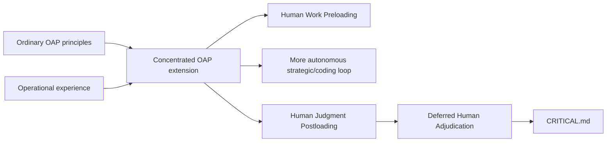

This is a proposed operational profile, not a replacement for every use of OAP. Ordinary OAP remains the safer default when requirements are unstable, the human must approve every change, or the execution environment directly touches production-critical systems.

The **Field note** boxes added to this edition are drawn from August 2026 SLAIF runs in which concentrated two-agent workflows operated through model failures, work-order corrections, hostile completeness audits, GPU qualification, and deferred security decisions. They are examples of observed workflow behavior, not universal performance claims. Quotations have been lightly edited where necessary for readability.

### 1.1 Evidence basis and limitations

Concentrated OAP was refined through an observational field exercise conducted during 22–24 August 2026. Its evidence base includes the public GitHub histories of four SLAIF software repositories, versioned OAP work orders and execution reports, CI results, OpenRouter request and token telemetry, and contemporaneous human–AI transcripts documenting strategic decisions, operational failures, corrections, and recovery.

The exercise was not a controlled benchmark. Repository activity and token volume demonstrate the scale and intensity of agentic execution, but they do not independently prove software quality or milestone completeness. Commits include implementation, tests, documentation, reports, corrective work, merge commits, generated material, and dependency updates. Prompt-token totals also include substantial cached context.

For that reason, the methodology treats activity metrics as evidence of implementation capacity—not evidence of completion. Product claims must instead be established through current code, boundary-faithful tests, CI, documentation, and an Independent Closure Audit.

---

## 2. Ordinary OAP: the baseline

### 2.1 Working model

The OAP Manual defines OAP as a human-governed, constitution-driven subtype of agentic software engineering. Its characteristic role separation is:

- the **human lead** owns problem definition, product purpose, domain truth, risk appetite, priorities, acceptance criteria, release decisions, and accountability;
- the **strategic AI** acts as control plane, architecture and planning layer, memory layer, work-order author, critic, evidence synthesizer, and first reviewer;
- the **execution agent** performs repository and machine work, usually in a hardened and rebuildable environment;
- the **remote repository, pull requests, CI, tests, documentation, and review trail** preserve durable project truth.

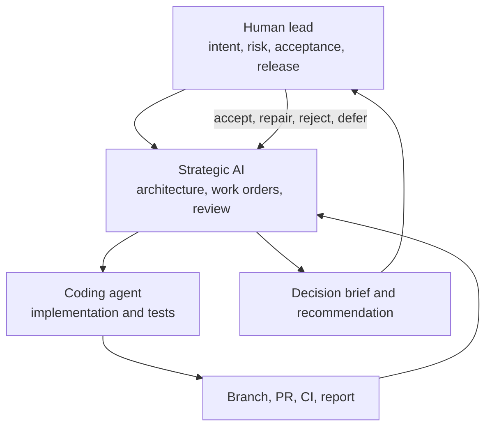

Ordinary OAP is not ordinary AI pair programming. The human does not need to remain beside the coding agent. The human interacts mainly through the strategic layer and asks managerial questions about goal match, proof, safety, scope, and readiness.

### 2.2 Ordinary OAP lifecycle

A typical ordinary OAP lifecycle is:

1. human and strategic AI perform discovery;
2. the project constitution and architecture are written;
3. the strategic AI prepares a bounded work order;
4. the execution agent implements it and returns evidence;
5. the strategic AI reviews the result;
6. the human judges the strategic review and authorizes merge, repair, rejection, or release as appropriate;
7. the cycle repeats.

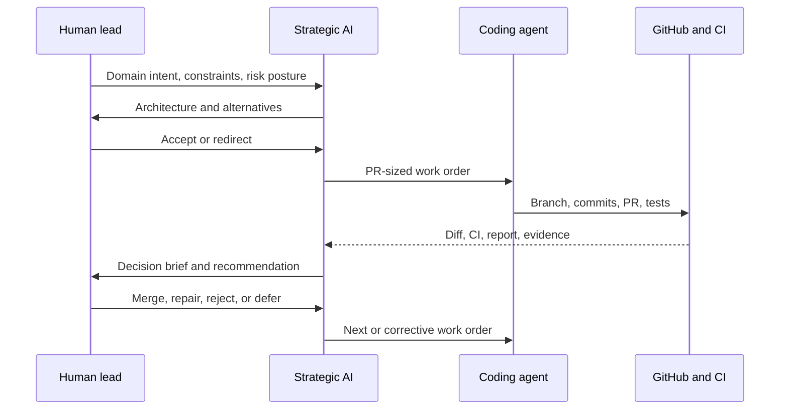

### 2.3 Ordinary OAP human gates

The manual preserves human approval for consequential actions such as:

- production deployment;
- merge to protected branches;
- destructive data operations;
- credential rotation;
- public release claims;
- adding risky dependencies;
- widening network access;
- changing security posture.

It also states that the strategic model is the default first reviewer, not the final accountable reviewer. A model can miss risk, overpraise a result, or rationalize a weakness. Ordinary OAP therefore keeps the human available at recurring management and release gates.

### 2.4 Why ordinary OAP is already powerful

Ordinary OAP already provides several essential foundations that Concentrated OAP retains unchanged:

- strategic discovery before coding;
- machine-readable project law in a constitution;
- narrow, reviewable, PR-sized work units;
- durable repository and CI truth;
- explicit evidence and negative-path testing;
- bounded high-autonomy execution;
- documentation and handoffs as operational memory;
- honest distinction between implemented scope and claimed readiness;
- human accountability for the resulting system.

Concentrated OAP does not weaken these foundations. It attempts to **reduce the frequency of routine human interruption** while making unresolved judgment more visible and enforceable.

---

## 3. The operational limitation: strategic reluctance to decide

In long autonomous runs, a strategic agent may encounter a dilemma that it understands technically but does not want to resolve without a human. Typical examples include:

- whether a security boundary may be relaxed for an MVP;
- whether an authorization model is sufficiently conservative;
- whether deletion should be hard, soft, or represented as a tombstone;
- whether a scanner warning is an acceptable false positive;
- whether a provisional authentication mechanism is acceptable in a confined demo;
- whether a design should favor speed, reversibility, provenance, or simplicity;
- whether a technically legitimate architecture change exceeds the intended risk budget.

The failure mode is not always ignorance. It is often **decision aversion**:

> “Both choices are plausible and consequential. A human should decide.”

> **Field note — The model knew, but did not want to own the choice.**
>
> The extension began with a repeated human observation from live strategic-agent runs: the agent could enumerate the alternatives, consequences, and mitigations for security boundaries or security-model relaxations, yet still stopped because it preferred a human to own the consequential choice immediately. Paraphrased, the human's complaint was: *“The problem is not that it does not know how to decide. It does not want to decide.”*
>
> That distinction matters. Missing knowledge requires investigation. Decision aversion inside an already delegated, reversible design space requires a forced provisional choice plus an honest future human gate.

That response is reasonable in a generic assistant. In a deliberately preloaded autonomous delivery loop, however, it can halt the entire project for a decision that is reversible, locally containable, and within the delegated design space.

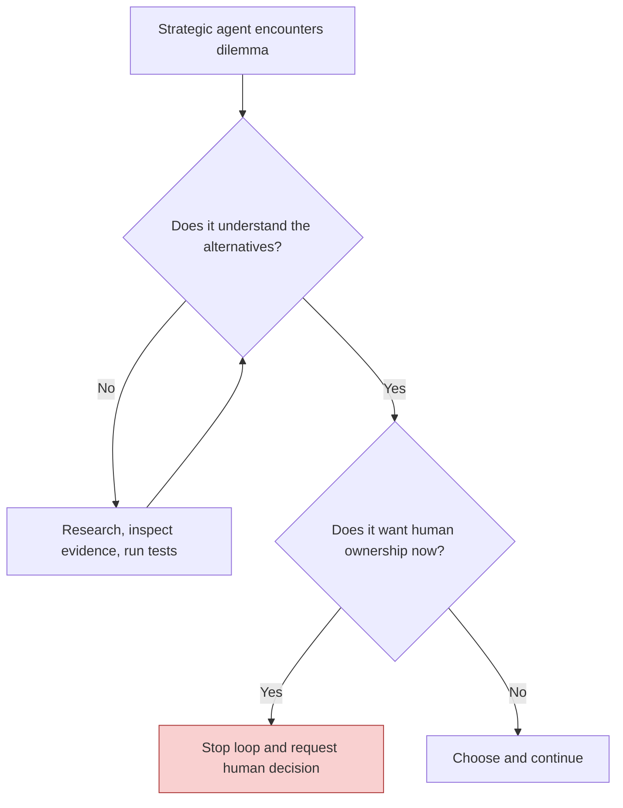

Repeated stops create several costs:

- serial latency while the human is unavailable;
- loss of strategic context while waiting;
- fragmented attention for the human;
- pressure to answer quickly without reviewing the full evidence;
- a return to human-in-the-loop scheduling;
- reduced value from an otherwise autonomous two-agent architecture.

Concentrated OAP addresses this by changing the default rule:

> **A difficult but reversible development decision is not, by itself, permission to stop.**

---

## 4. Human Work Preloading (HWP)

### 4.1 Definition

**Human Work Preloading (HWP)** is the deliberate concentration of human engineering judgment before autonomous execution, encoded into durable project artifacts so that the strategic and coding agents can operate for long periods without routine human intervention.

The word **work** is important. The human is not merely supplying background context. The human has already performed substantial engineering labor:

- defining the product;
- resolving major architectural alternatives;
- deciding trust boundaries;
- deciding what “done” means;
- setting the risk budget;
- sequencing the work;
- specifying what must not be improvised;
- defining the distinction between demo, MVP, pilot, and production readiness.

### 4.2 HWP as compilation of judgment

HWP turns diffuse human understanding into executable project governance.

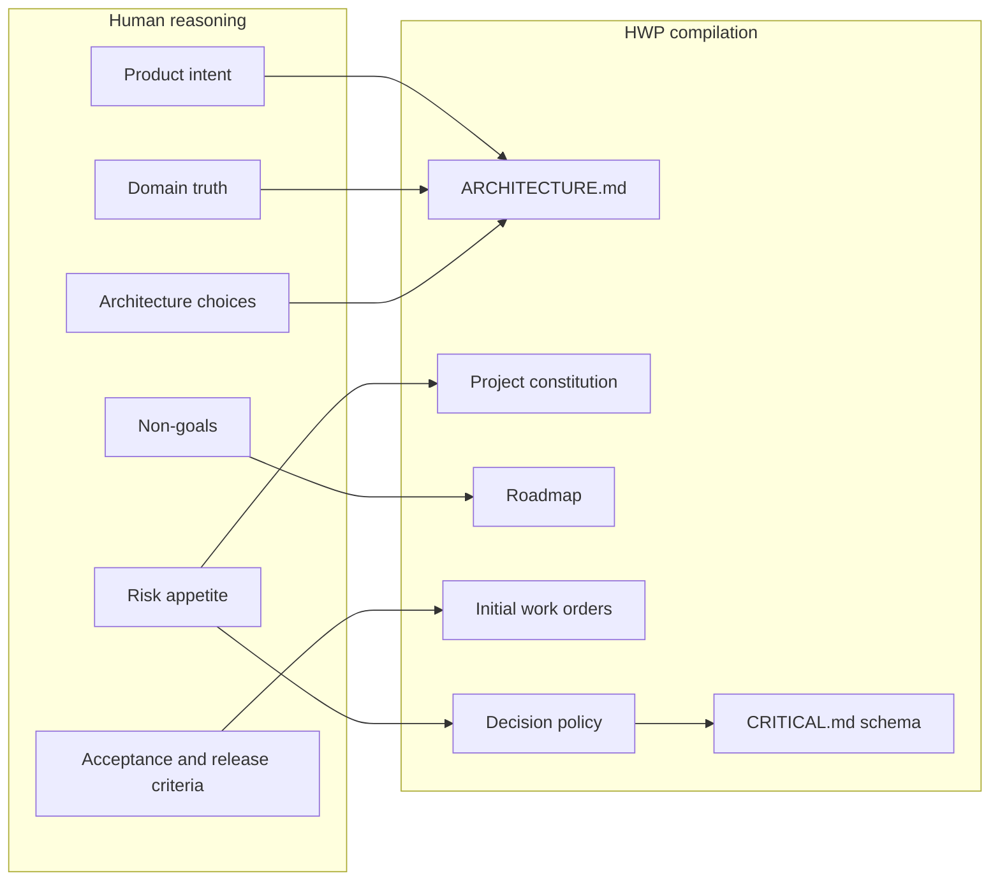

The resulting artifacts act as a durable “preloaded management state” for the strategic agent.

### 4.3 Minimum HWP artifact set

A serious HWP package should normally include:

| Artifact | Purpose |
|---|---|
| `ARCHITECTURE.md` | Human-readable product shape, boundaries, components, data flows, deployment model, and rationale. |
| `AGENTS.md` or equivalent | Condensed operational law for the coding agent. |
| Strategic-agent constitution | Role, authority, review duties, merge policy, and decision rules. |
| Security and testing documents | Non-negotiable security invariants and evidence requirements. |
| Roadmap | Ordered objectives and milestone definitions. |
| Initial work orders | Concrete first execution slices with acceptance criteria. |
| Non-goals | Explicitly postponed work and forbidden scope expansion. |
| Readiness definitions | Separate criteria for demo, MVP, pilot, and production. |
| Decision classification | D0, D1, and D2 rules described later in this document. |
| `CRITICAL.md` template | Durable format for deferred human judgment. |
| Runtime constraints | Hosts, GPUs, ports, credentials, protected services, and test boundaries. |
| Recovery protocol | Rules for agent crash, context loss, stale branches, and partial work. |

### 4.4 HWP is not prompt engineering

Prompt engineering optimizes an interaction. HWP establishes a project operating system.

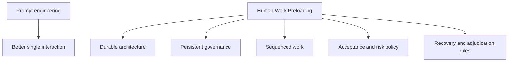

A prompt can disappear with a session. HWP artifacts are versioned, reviewable, diffable, and reusable across agents and model contexts.

### 4.5 HWP is not immutable design

Preloading does not mean the initial architecture is perfect. It means that changes become explicit engineering events.

The strategic agent may refine the design when evidence demands it, but it must not silently redefine:

- product purpose;
- domain truth;
- ethical or legal boundaries;
- explicit non-goals;
- non-delegable security constraints;
- production authorization.

A change inside the delegated design space may be D0 or D1. A change that would redefine human intent or cross a non-delegable boundary is D2.

> **Field note — Preloaded intent met an 11 GB GPU.**
>
> The ZAP-IT preload described development on physical GPU1 and carried an early assumption that the card had roughly 22–24 GB of VRAM. Live qualification found an ordinary 11 GB RTX 2080 Ti. The strategic process did not discard the product goal and did not pretend the preload was factually correct. It preserved the intent—use GPU1, protect GPU0, produce a real service—then measured the model stack, kept SAM2 and CLIP resident, and refused to load BLIP3 beyond the safety budget.
>
> **HWP preloads direction and judgment. It does not make reality subordinate to the draft.**

---

## 5. Concentrated OAP: the autonomous development loop

### 5.1 Definition

**Concentrated OAP** is an HWP-enabled OAP profile in which:

- the human performs a concentrated preload;
- a logically persistent strategic role carries project continuity;
- a disposable or restartable coding agent performs one bounded work order at a time;
- GitHub, CI, reports, and project documents are authoritative;
- the strategic agent may issue corrective work orders and merge development PRs when policy permits;
- consequential uncertainty is recorded instead of hidden;
- the human returns at explicit adjudication and deployment gates.

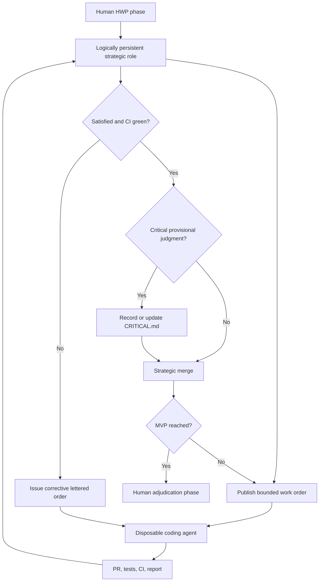

### 5.2 Logically persistent strategy, disposable execution

The architecture intensifies an asymmetry already present in OAP:

“Persistent” describes continuity of authority and project understanding, not immortality of one process. The strategic role may be re-instantiated with a different model or provider as long as it reconstructs the same protocol state from durable artifacts before acting.

- strategic context should be long-lived because it contains product continuity, architecture, roadmap, review history, and unresolved risk;
- coding context should be task-local because implementation details become stale and consume context;
- durable truth should live in GitHub and repository artifacts, not in either model’s hidden memory.

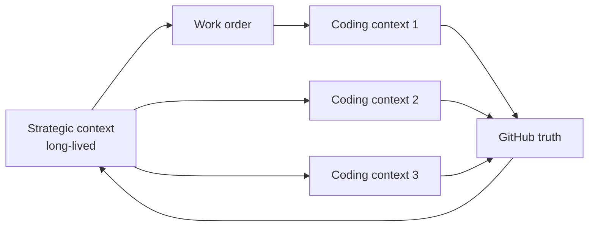

> **Field note — Changing the brain did not change the project.**
>
> During the weekend field run, OpenCode providers failed, coding sessions died after coordination signals had been consumed, models were replaced, strategic sessions became non-resumable, and fresh processes were started in new terminals. The recovery law remained: *“GitHub is software truth; OAP files are orchestration truth; process/session memory is disposable.”* A fresh strategic process was forbidden to replay merged objectives or recreate their PRs merely because its predecessor disappeared.
>
> **Operational lesson:** strategic persistence is logical persistence of role, authority, and transcript—not continuous consciousness in one model session.

### 5.3 Automatic strategic merge is development authority, not release authority

A major difference from ordinary OAP is that the strategic agent may be authorized to merge PRs after independent review when all required conditions hold.

This does **not** mean the strategic agent owns production release. It means that the meaning of a merged development PR is:

> “This is the best evidence-backed provisional engineering state currently accepted for continued development.”

It does not necessarily mean:

> “A human has accepted every security, legal, operational, and trust-model decision for production.”

The distinction is enforced through the dual-gate model described later.

### 5.4 Conditions for autonomous strategic merge

The strategic agent may merge only when all applicable conditions hold:

1. the PR implements the active work order;
2. the diff is bounded and coherent;
3. required CI and tests are green;
4. test evidence is meaningful, not merely syntactic;
5. documentation matches behavior;
6. no secret or prohibited artifact has been introduced;
7. no D2 boundary has been crossed;
8. every D1 decision has a complete `CRITICAL.md` entry;
9. rollback or reversibility is adequate for the development stage;
10. the strategic agent can explain the strongest reason not to merge and why it is nevertheless acceptable for continued development.

### 5.5 Work-order provenance and the anti-busywork rule

A long autonomous loop must be able to explain why every new objective exists. Concentrated OAP therefore requires each strategic work order to trace to one or more durable origins:

```text
H  explicit human instruction or preload
A  architecture, constitution, contract, or roadmap
E  observed failing evidence
I  independent audit finding
C  CRITICAL/DHA remediation
```

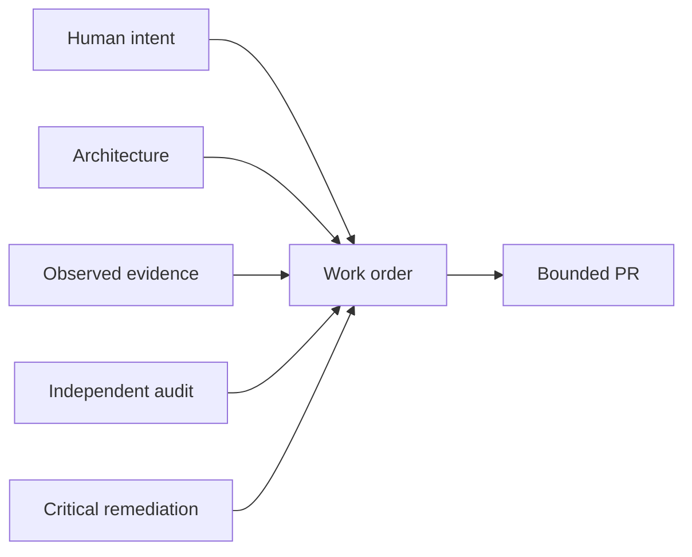

A strategic agent should not create work merely because a neighboring improvement seems attractive. Conversely, non-functional work with explicit human or audit provenance—such as restoring unique objective numbering, correcting false readiness claims, or preserving an auditable transcript—must not be dismissed as agent bureaucracy.

> **Field note — “Are they closing the architecture, or inventing work?”**
>
> The human repeatedly asked whether the Agent-Site closure sequence was increasing actual completeness or merely producing activity. The answer became defensible only by mapping each objective back to missing architecture: runtime wiring, capability authority, COW writes, Puck, media, rendering, Playwright, review, promotion, and defining E2E proofs. One apparent example of “bureaucracy”—renumbering the sequence—was later correctly reclassified when the human clarified that it had been explicitly requested to keep the OAP trail unambiguous.
>
> **Operational rule:** no autonomous order without provenance; no criticism of process work without first checking its provenance.

---

## 6. Human Judgment Postloading and Deferred Human Adjudication

### 6.1 Terminology

**Human Judgment Postloading (HJP)** is the temporal design principle: human judgment that cannot be usefully or economically supplied before execution is deliberately scheduled after autonomous MVP development rather than interrupting every work order.

**Deferred Human Adjudication (DHA)** is the formal process by which the human later accepts, rejects, modifies, or requests more evidence for each recorded provisional decision.

The relationship is:

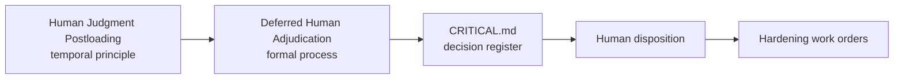

“HJP” is memorable and symmetrical with HWP. “DHA” is precise: the eventual human is adjudicating between alternatives, not merely proofreading code.

### 6.2 The forced-decision rule

When the strategic agent encounters a consequential dilemma within its delegated development authority, it MUST NOT stop merely because human ownership would be more comfortable.

It must:

1. inspect governing architecture and constitution;
2. gather available evidence;
3. identify credible alternatives;
4. compare risks, reversibility, blast radius, and stage suitability;
5. choose a provisional solution;
6. implement or order appropriate mitigation and tests;
7. record the dilemma and decision in `CRITICAL.md`;
8. continue the development loop.

The strategic agent is not allowed to erase uncertainty by writing a confident justification. It must preserve the uncertainty explicitly.

> **The autonomous system may resolve uncertainty provisionally, but it may not make the uncertainty disappear.**

### 6.3 What the forced-decision rule does not mean

“Forced to decide” does not mean “forced to perform every action.”

The strategic agent can be required to choose an architecture while still being prohibited from:

- deploying it to production;
- destroying real production data;
- rotating real credentials;
- widening a real firewall or public network boundary;
- making a legally binding or ethically non-delegable choice;
- processing real sensitive data under an unapproved trust model;
- overriding explicit human product intent;
- accepting an irreversible external obligation.

This distinction produces three decision classes.

---

## 7. Decision classes: D0, D1, and D2

### 7.1 Classification

| Class | Meaning | Strategic-agent behavior | Human timing |
|---|---|---|---|
| **D0 — Ordinary delegated decision** | Reversible, low-consequence engineering choice inside architecture and risk budget. | Decide, test, document normally, continue. | No special adjudication required. |
| **D1 — Deferred critical judgment** | Consequential but containable and reversible enough for continued development. Multiple legitimate choices exist. | Decide provisionally, mitigate, add tests, record in `CRITICAL.md`, merge if development gate passes. | Human adjudicates before the declared release/deployment boundary. |
| **D2 — Non-delegable boundary** | Would cross production, destructive, legal, ethical, credential, public-exposure, or explicit human-authority boundary. | Analyze and recommend; may implement safely in isolation if authorized; MUST NOT cross the real boundary. | Human authorization required before action. |

### 7.2 Decision flow

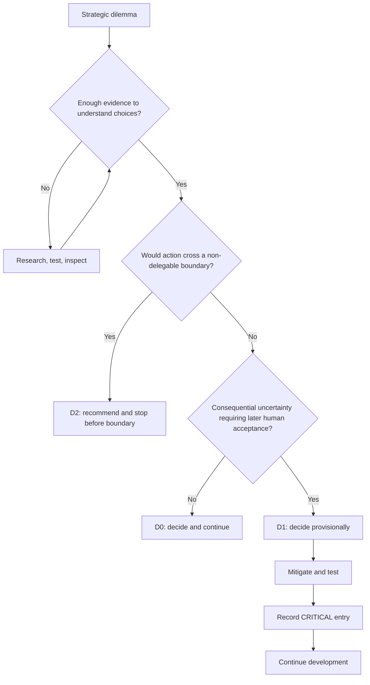

### 7.3 Default D2 boundaries

The human approval gates identified in ordinary OAP should normally map to D2:

- production deployment;
- merge or release operations that directly deploy to production;
- destructive operations on production or irreplaceable data;
- real credential rotation or disclosure;
- public release claims with legal or contractual consequence;
- risky dependency acceptance where licensing or supply-chain obligations are unresolved;
- widening real network access;
- changing the real production security posture.

An organization may add additional D2 boundaries in its preload.

### 7.4 Examples

| Dilemma | Likely class | Reason |
|---|---:|---|
| Choose cache library A or B | D0 | Routine, reversible engineering choice. |
| Use soft-delete or hard-delete for demo-only synthetic records | D1 | Data-integrity and provenance consequences, but containable. |
| Merge a scanner-flagged SSRF pattern behind strict local allowlists for continued development | D1 | Security judgment requiring later human review. |
| Keep a placeholder auth implementation in an isolated demo | D1, with deployment block | Development may continue, external deployment may not. |
| Expose that placeholder-auth service to the public Internet | D2 | Crosses a real security boundary. |
| Delete production customer data | D2 | Irreversible, destructive, externally consequential. |
| Redefine the product’s intended users or legal purpose | D2 | Changes human-owned product meaning. |

---

## 8. `CRITICAL.md`: the Deferred Human Adjudication Register

### 8.1 Purpose

`CRITICAL.md` is not merely a vulnerability list and not merely technical debt. It is an **autonomous judgment ledger**.

It records situations where:

- the strategic agent made a consequential provisional decision;
- a possible vulnerability remains;
- a security boundary was relaxed or interpreted;
- a scanner warning was accepted or deferred;
- authorization or trust semantics remain uncertain;
- data integrity or deletion semantics are debatable;
- an MVP shortcut would be unacceptable for production;
- an assumption is necessary but not yet human-approved;
- architecture and implementation are temporarily misaligned;
- external evidence is insufficient for production confidence.

The existing `slaif-agent-site/CRITICAL.md` demonstrates the basic pattern: autonomously merged PRs are listed with risk, decision taken, and review priority, including explicit “before production” and “before any deployment” gates.

> **Field note — The register existed before the methodology had a name.**
>
> Agent-Site had already accumulated a queue of autonomously merged decisions about privilege grants, hard deletion, placeholder authentication, SSRF mitigation, capability handling, and deployment gates. It was called a “Critical Review Queue,” but operationally it was already an autonomous judgment ledger: the agent chose a provisional path, development continued, and the human review obligation remained visible. HJP and DHA formalized an emergent practice rather than inventing it entirely on paper.

### 8.2 Judgment debt

A D1 decision creates **judgment debt**: a consequential choice has been made for development, but human acceptance remains outstanding.

Technical debt may be visible in code. Judgment debt is easier to hide because the implementation can look clean, tests can pass, and documentation can sound persuasive.

Concentrated OAP therefore adopts this law:

> **Autonomy may accumulate implementation debt, but it may not accumulate invisible judgment debt.**

### 8.3 Required entry structure

Every D1 entry MUST include:

```markdown
## CRIT-0001 — Short decision title

- **Status:** OPEN — HUMAN ADJUDICATION REQUIRED
- **Introduced by:** PR #123 / OAP objective 037-a
- **Category:** security | authorization | data integrity | privacy | operations | architecture | dependency | other
- **Severity:** low | medium | high | critical
- **Decision confidence:** low | medium | high
- **Required human gate:** before pilot | before external demo | before production | before irreversible migration
- **Affected components:** ...

### Dilemma
What consequential question lacked a clearly mandated answer?

### Decision taken
What did the strategic agent choose?

### Reasoning
Why was this judged the best provisional choice at the current stage?

### Alternatives considered
What credible alternatives existed?

### Strongest argument that this decision is wrong
State the best counterargument, not a token objection.

### Assumptions
What must be true for the decision to remain sound?

### Failure mode and blast radius
What could happen if the decision is wrong, and what would be affected?

### Mitigations and evidence
What tests, controls, isolation, monitoring, or constraints reduce the risk?

### Reversibility and rollback
How can the decision be changed later? What would migration cost?

### Safe autonomous continuation
Why is it safe to proceed without immediate human adjudication? What exact
work may continue autonomously, and what must remain blocked?

### Exact human gate
Before which demo, pilot, release, deployment, migration, exposure, or other
boundary must a human disposition exist?

### Exact question for the human adjudicator
What precise decision must the human eventually make?

### Strategic attestation
ALL FIVE CRITICAL-ENTRY CONDITIONS SATISFIED

### Human disposition
PENDING — append separately; do not edit this entry.

### Resolution
PENDING — cleared only by the latest appended human `ACCEPTED` disposition.
```

### 8.4 Admission threshold: the anti-garbage mechanism

A `CRIT-NNNN` entry is permitted only when **all five conditions** are satisfied:

1. Existing human instructions, constitution, architecture, active work order,
   and available evidence do not resolve the issue.
2. The strategic agent has investigated enough to identify materially different
   alternatives and must choose one.
3. A wrong choice could materially affect security, authorization, privacy,
   data integrity, irreversible loss, trust boundaries, public exposure,
   deployment safety, or release acceptability.
4. One provisional choice can be implemented and tested safely without crossing
   a non-delegable external or production boundary.
5. A competent human could plausibly reject or materially change the choice
   before the declared gate.

The register explicitly excludes:

- ordinary implementation decisions;
- bugs and failed tests;
- TODOs and known limitations;
- refactoring and style choices;
- ordinary dependency choices;
- speculative risks unsupported by concrete evidence;
- low-impact reversible trade-offs;
- repeated entries for the same underlying dilemma.

This threshold prevents `CRITICAL.md` from becoming a convenient uncertainty
inbox. The strategic agent must do the reasoning first. The register is reserved
for consequential **judgment debt**, not everything that is unfinished,
uncomfortable, or imperfect.

### 8.5 Every finalized work order declares the adjudication outcome

In the strict mechanically enforced profile, every finalized work order MUST
contain one of these declarations:

```markdown
## Deferred human adjudication
- Decision: NONE
```

or:

```markdown
## Deferred human adjudication
- Decision: APPEND CRIT-0001
```

`NONE` is expected in nearly every order and requires no defensive boilerplate.
An `APPEND` order is invalid unless it includes the complete strategic-authored
entry, including the strongest case that the decision is wrong, assumptions,
failure mode and blast radius, mitigations and evidence, rollback, the exact
human question, safe autonomous continuation, the exact human gate, and the
attestation:

```text
ALL FIVE CRITICAL-ENTRY CONDITIONS SATISFIED
```

A repository implementation can enforce this in `publish_order.py`: reject a
finalized order that omits the declaration, and reject `APPEND` unless the entry
is complete and the attestation is present. This converts the anti-garbage rule
from advice into a publication invariant.

### 8.6 Append-only-in-spirit lifecycle

Agents may add evidence, mitigation, links, and superseding implementation details. They may not erase the historical dilemma or mark it human-approved themselves.

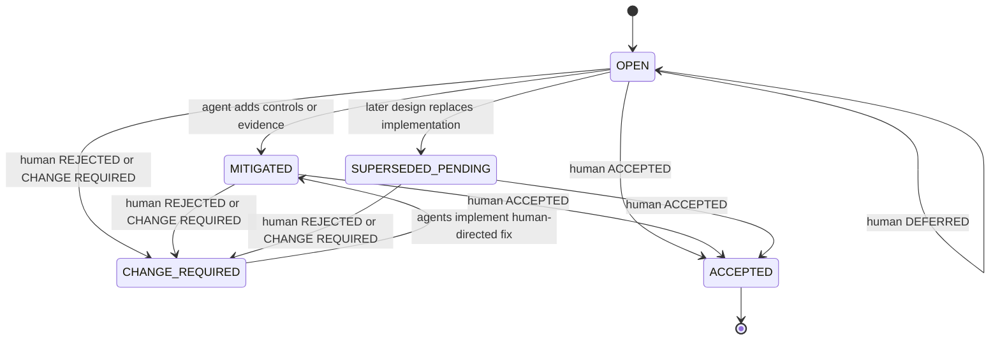

### 8.7 Human dispositions are appended, never rewritten

Agents may not close entries. A human disposition is appended as a separate,
attributable record:

```markdown
## HUMAN ADJUDICATION — CRIT-0001 — 2026-09-15
- Decision: ACCEPTED
- Authority: Janez Perš / project owner
- Conditions or required follow-up:
- Evidence/reference:
```

Allowed decisions are:

```text
ACCEPTED
REJECTED
CHANGE REQUIRED
DEFERRED
```

Only the latest human `ACCEPTED` disposition clears the registered gate.
`DEFERRED`, `REJECTED`, and `CHANGE REQUIRED` remain blocking. Later mitigation
or a superseding implementation does not silently close the original judgment;
it supplies evidence for a later human disposition.

A mechanically enforced repository should make `check_state.py` report:

- all critical entry identifiers;
- duplicate identifiers;
- the latest human disposition for each entry;
- entries accepted for their registered gate;
- entries whose gates remain open.

### 8.8 Integrity rules

`CRITICAL.md` should obey the following invariants:

- every entry has a stable identifier such as `CRIT-0001`;
- every entry links to the introducing PR and objective;
- entries cannot be silently deleted;
- an agent cannot set `HUMAN_ACCEPTED`;
- a “mitigated” entry remains pending until adjudicated;
- deployment tooling can identify open blocking entries mechanically;
- summaries may be generated, but the detailed entry remains authoritative;
- security tool warnings accepted as false positives remain visible until the relevant human gate.

### 8.9 Deliberate context-loading policy

`CRITICAL.md` is not an always-loaded instruction file. It should normally be
excluded from `opencode.json` or any equivalent routine instruction list supplied
on every model turn.

Instead:

- the strategic agent reads it at startup, before a release or deployment gate,
  and whenever a related dilemma or existing entry becomes relevant;
- the coding agent reads it only when the active work order requires an exact
  append or a relevant cross-reference;
- summaries or state-check output may be loaded routinely, but not the full
  historical register.

This preserves context capacity and prevents the register from becoming an easy
substitute for fresh strategic reasoning. The agent must first investigate the
current issue; it may consult `CRITICAL.md` to detect related prior dilemmas and
avoid duplicates, not to dump routine uncertainty into the queue.

---

## 9. The dual-gate model

### 9.1 Why two gates are necessary

Concentrated OAP separates:

1. the **development merge gate**; and
2. the **human deployment gate**.

Without this separation, automatic strategic merge would imply more confidence than the workflow actually has.

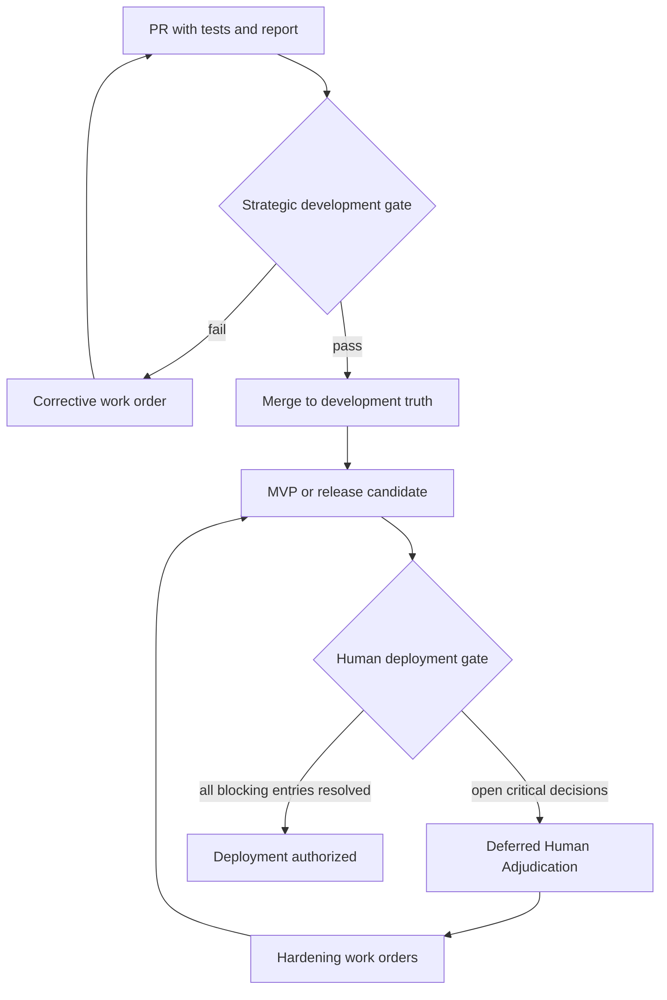

### 9.2 Development merge gate

The strategic agent may merge when:

- the work order is satisfied;
- CI is green;
- the diff is coherent;
- evidence is adequate for continued development;
- no D2 action occurred;
- all D1 decisions are explicitly registered;
- the merged state does not falsely claim production readiness.

### 9.3 Human deployment gate

The human deployment gate evaluates:

- every open `CRITICAL.md` entry whose gate applies;
- security and privacy boundaries;
- trust and authorization model;
- data lifecycle and destructive operations;
- operational recovery and monitoring;
- external exposure;
- licensing and compliance where relevant;
- whether MVP shortcuts must be removed;
- whether the accepted residual risk matches organizational risk appetite.

### 9.4 Merge does not equal deployment approval

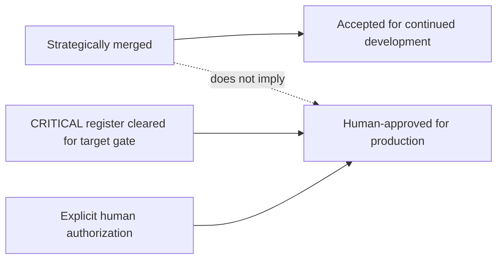

This semantic distinction must be visible in documentation, branch protection, release tooling, and organizational communication.

In compact form:

```text
strategic merge
=
best available bounded provisional engineering decision,
safe for continued development
```

but:

```text
strategic merge
≠
human approval for deployment across a registered gate
```

An open critical entry is therefore not a waiver for public exposure, production
or real customer data, destructive production mutation, disabling mandatory
controls, external privilege expansion, or final release across the stated
human gate.

---

## 10. MVP-ready versus production-ready

A core benefit of the extension is an honest separation of readiness levels.

| Dimension | MVP/demo-ready | Production-ready |
|---|---|---|
| Core workflow | Works for intended demonstration | Works under qualified operational conditions |
| Tests | Sufficient to demonstrate implemented behavior | Includes critical invariants, failure recovery, security, load, and operational tests |
| Security decisions | May contain explicit D1 provisional choices | Blocking choices human-adjudicated and remediated |
| Authentication | May be isolated or provisional if clearly blocked from exposure | Fully implemented, tested, reviewed, and operationally managed |
| Data | Synthetic, disposable, or tightly controlled | Real data lifecycle, retention, deletion, backup, and recovery approved |
| Deployment | Local or confined demo environment | Approved infrastructure and exposure model |
| `CRITICAL.md` | Open entries allowed if their gates are not crossed | No unresolved entries blocking the target deployment |
| Claims | “MVP”, “demo”, “prototype”, or similarly honest label | Claims match verified production scope |

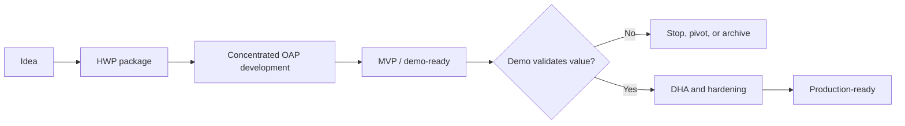

This is especially valuable for SMEs. Enterprise hardening is expensive. It should not necessarily precede proof that the product is useful. But demo shortcuts must not become invisible production defaults.

### 10.1 Independent Closure Audit: the milestone self-evaluation firewall

Concentrated OAP creates an unusually strong self-confirmation risk. The same strategic role may have:

- interpreted the preload;
- authored the roadmap and work orders;
- reviewed the implementation reports;
- issued corrections;
- merged the PRs;
- summarized progress;
- and finally asked itself whether the milestone is complete.

That role may recommend closure, but it must not self-certify solely from its own queue and narrative. Before “MVP complete,” “release candidate,” or an equivalent architecture-defined milestone, run an **Independent Closure Audit (ICA)** using a fresh model/context, an explicitly hostile review mode, or an independent human/audit agent.

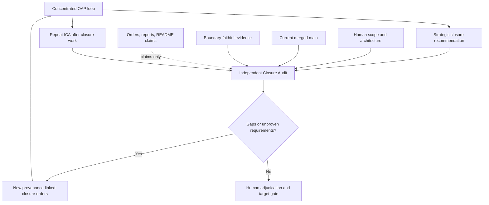

The audit classifies each requirement as **implemented**, **partial**, **absent**, or **unproven**. Completing every item in a closure plan is not enough; the plan itself may have omitted architecture requirements, so the audit is repeated after remediation.

> **Field note — “Do not trust the agents.”**
>
> During the Agent-Site run, the surrounding autonomous evidence trail had converged on a “100% MVP” characterization. The human ordered a fresh rescore from architecture and current `main`: *“Do not trust the agents.”* The hostile audit treated reports, PR descriptions, README percentages, and green-check summaries as claims until code and runtime paths supported them. It found several defining paths still synthetic, stubbed, or unwired and revised the informal completeness estimate to roughly 40 percent.
>
> The resulting closure sequence was substantially better—but another review noticed that even this sequence might omit MCP, complete media operations, source reconstruction, and some visual targets. The lesson was sharper than “audit once”: **a closure plan is not evidence that the closure plan is complete.**

---

## 11. Full HWP–OAP–HJP lifecycle

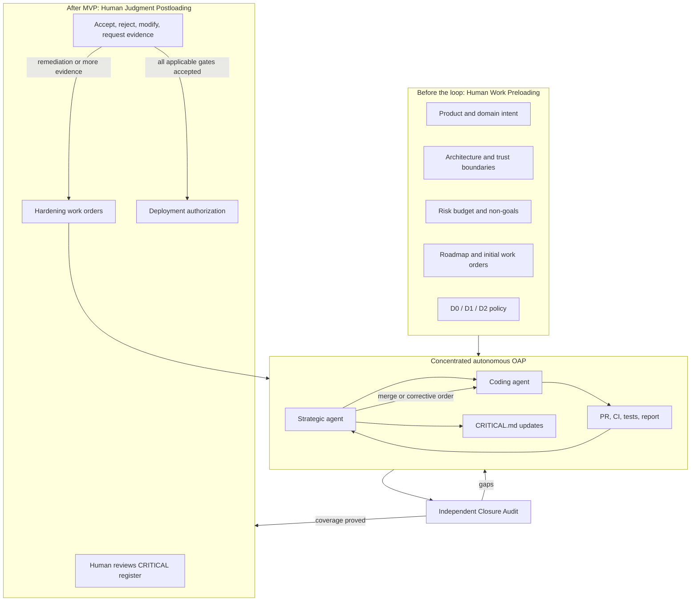

The human is not removed. Human work is redistributed:

- **before the loop:** high-density architecture and governance work;
- **during the loop:** exceptional intervention only;
- **after independent closure of the MVP claim:** focused adjudication of recorded judgment debt;
- **before deployment:** explicit authorization.

---

## 12. Ordinary OAP versus Concentrated OAP

| Dimension | Ordinary OAP | Concentrated OAP with HWP/HJP |
|---|---|---|
| Human role | Human remains available at recurring strategic review and approval gates. | Human concentrates work before the loop and returns at milestone/adjudication/deployment gates. |
| Initial preparation | Strategic discovery and constitution precede execution. | Much deeper preload: architecture, roadmap, work-order sequence, decision taxonomy, critical-register law, and readiness semantics. |
| Strategic AI | Advisory control plane and first reviewer. | Logically persistent delegated development supervisor, work-order authority, first reviewer, and conditional merge authority. |
| Coding agent | Executes PR-sized work and returns evidence. | Same, often more disposable and mechanically driven by strategic work orders. |
| Merge authority | Human approval is normally required for protected branches. | Strategic agent may merge development PRs under strict policy; human retains release/deployment authority. |
| Difficult dilemma | Strategic AI may prepare the issue for human decision. | Strategic AI must decide D0/D1; D1 is recorded for later adjudication. |
| Human interruption | Expected at meaningful review and approval points. | Minimized during development; reserved for D2 or explicit milestone gates. |
| Uncertainty handling | Often surfaced in decision brief before merge or release. | Converted into visible judgment debt in `CRITICAL.md`; development may continue. |
| Critical artifact | Decision brief, review report, remediation list. | All ordinary artifacts plus a durable Deferred Human Adjudication Register. |
| Readiness model | Human judges merge and release readiness continuously. | Explicit dual readiness: development/MVP acceptance versus production authorization. |
| Milestone completion claim | Human and strategic review certify completion at ordinary gates. | The concentrated loop may recommend closure but must pass a fresh Independent Closure Audit before the milestone is accepted. |
| Risk posture | Conservative human-governed cadence. | Aggressive development velocity with strict containment and deferred deployment gate. |
| Best fit | High-risk work, changing goals, or teams requiring frequent human control. | Well-preloaded MVP programs, time pressure, isolated environments, and SMEs proving value before hardening. |

### 12.1 Human-attention distribution

```mermaid
flowchart TD
    subgraph Ordinary[Ordinary OAP]
        O1[Human discovery]
        O2[Agent work]
        O3[Human review]
        O4[Agent repair]
        O5[Human merge decision]
        O6[Next cycle]
        O1 --> O2 --> O3 --> O4 --> O5 --> O6
    end

    subgraph Concentrated[Concentrated OAP]
        C1[Heavy human preload]
        C2[Long autonomous development interval]
        C3[MVP]
        C4[Focused human adjudication]
        C5[Autonomous hardening]
        C6[Human deployment decision]
        C1 --> C2 --> C3 --> C4 --> C5 --> C6
    end
```

---

## 13. Authority and responsibility

### 13.1 Authority matrix

| Activity | Human | Strategic agent | Coding agent |
|---|---:|---:|---:|
| Define product purpose and domain truth | **Owns** | Advises and challenges | No authority |
| Define risk appetite and D2 boundaries | **Owns** | Drafts and applies | Must obey |
| Maintain architecture | Approves foundational intent | Owns delegated evolution | Implements ordered changes |
| Create work orders | May direct | **Primary authority** | No authority to self-assign broad objectives |
| Implement and test | Optional targeted work | Reviews | **Primary authority** |
| Create/amend PR | Optional | Supervises | **Primary authority** |
| Review PR and CI | May inspect | **Primary development reviewer** | Supplies evidence, cannot self-approve |
| Merge development PR | Delegated by policy | **Conditional authority** | Never |
| Record D1 judgment | May add | **Determines necessity, authors exact entry, assigns ID** | May report a candidate; cannot invent or rewrite the entry |
| Resolve `CRITICAL.md` entry | **Exclusive final authority** | Recommends | Implements resulting work |
| Cross D2 boundary | **Exclusive authority** | Must stop before action | Must not act |
| Authorize production deployment | **Exclusive authority** | Prepares evidence | Executes only after authorization |
| Accountability | **Retains** | Not accountable | Not accountable |

### 13.2 Authority flow

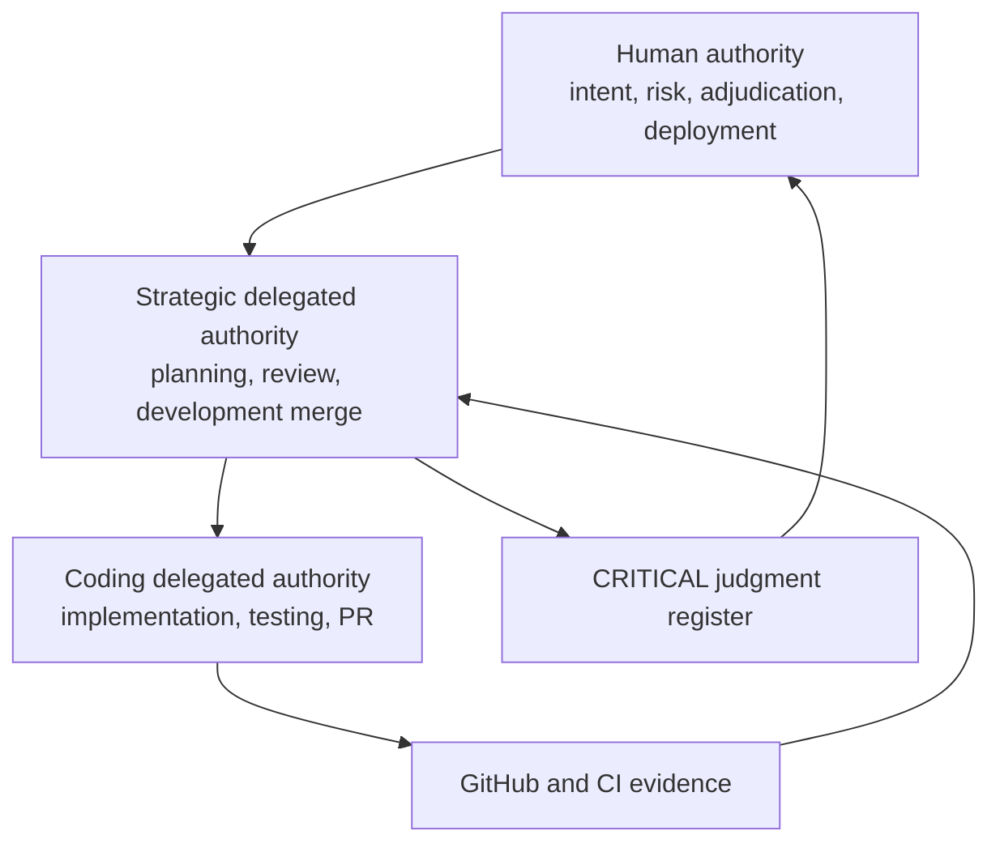

Delegation does not transfer accountability. The human or organization remains responsible for the system and for the decision to deploy it.

### 13.3 Authorship and append mechanics

The strategic agent owns whether an entry is warranted. It must investigate,
make the provisional decision, assign the next `CRIT-NNNN` identifier, author the
exact entry, include it in the current work order or a same-PR corrective order,
and verify that it was appended without changing previous entries. If continued
development is safe and the development merge gate passes, it may still merge
while preserving the human gate.

The coding agent cannot invent a critical entry or rewrite the strategic
judgment. It may append only the exact ordered bytes, preferably through a
narrow helper such as:

```bash
python oap/bin/append_critical.py \
  --repo-root "$REPO_ROOT" \
  --source /path/to/strategic-authored-entry.md \
  --id CRIT-0001
```

The append belongs in ordinary implementation work and is committed before the
implementation SHA is captured. It must never be smuggled into the final
report-only commit. The coding agent may not edit, delete, weaken, close, or mark
an entry human-approved.

If the coding agent independently discovers a possible consequential issue, it
may report a **candidate** with evidence. Only the strategic agent may decide
whether the five-condition threshold is met and order an append.

---

## 14. Strategic-agent decision protocol

When a D1 dilemma appears, the strategic agent should follow a reproducible protocol rather than improvising a persuasive justification.

### 14.1 Decision procedure

1. **Name the dilemma precisely.** Avoid vague language such as “security may be a concern.”
2. **Locate governing authority.** Cite architecture, constitution, work order, tests, standards, or code.
3. **Generate credible alternatives.** Include at least one materially different approach when possible.
4. **Evaluate stage suitability.** A good MVP decision may be a bad production decision.
5. **Prefer reversibility.** Under uncertainty, prefer the option that preserves future correction.
6. **Prefer containment.** Confine provisional risk to local, synthetic, or non-production contexts.
7. **Prefer fail-closed behavior** for security and authorization unless the preload explicitly says otherwise.
8. **Choose.** Do not end with “human should decide” for D1.
9. **Mitigate and test.** Add controls proportional to the provisional risk.
10. **Write the strongest counterargument.** Explain how the decision could be wrong.
11. **Record the entry.** Commit `CRITICAL.md` in the same PR or before strategic merge.
12. **Continue.** Move to the next objective unless a D2 boundary is reached.

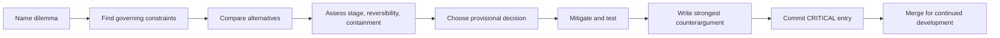

### 14.2 Confidence is not permission to omit

A high-confidence strategic decision may still be D1 if the consequence is high. A low-confidence decision is not automatically D2 if it remains reversible and contained.

Classification depends on authority and consequence, not only model confidence.

### 14.3 Allowed reasons to stop

The strategic agent MAY stop and request immediate human intervention when:

- a D2 boundary would otherwise be crossed;
- explicit project instructions conflict irreconcilably;
- required human product intent is absent and any choice would redefine the product;
- an imminent action could cause irreversible harm;
- available evidence is insufficient even to choose a containable provisional path;
- legal, ethical, contractual, or organizational authority cannot be delegated;
- the runtime cannot safely isolate the proposed work.

It MUST NOT stop merely because:

- two reasonable libraries exist;
- a reversible architecture choice is uncomfortable;
- the strategic agent prefers a human to absorb reputational responsibility;
- perfect certainty is unavailable;
- production hardening is incomplete but the current work is confined to MVP development.

---

## 15. Failure modes introduced by the extension

Concentrated OAP increases autonomy and therefore introduces risks beyond ordinary OAP.

### 15.1 Strategic self-rationalization

The same model may choose a design and then review its own reasoning. It can produce a coherent but biased explanation.

**Mitigations:**

- mandatory strongest-counterargument section;
- separate coding and strategic roles;
- independent CI and scanners;
- external model or human audit at milestones;
- explicit confidence and assumptions;
- evidence links rather than prose-only justification.

### 15.2 Missing critical entries

The greatest danger is not a bad recorded decision but an unrecorded one.

**Mitigations:**

- work-order template asks whether D1 decisions were introduced;
- coding report has a “critical decisions discovered” section;
- strategic merge checklist requires `CRITICAL.md` review;
- automated diff rules flag changes to auth, permissions, deletion, networking, credentials, migrations, security policy, and data retention;
- release tooling fails if required critical metadata is missing.

### 15.3 Compounding provisional decisions

Several individually defensible shortcuts can combine into an unsafe architecture.

```mermaid
flowchart LR
    D1A[D1 auth shortcut] --> C[Combined system]
    D1B[D1 network shortcut] --> C
    D1C[D1 logging shortcut] --> C
    C --> X[Emergent high risk]
```

**Mitigations:** periodic aggregate review of the complete `CRITICAL.md`, not only entry-by-entry review; dependency links between entries; milestone-level threat-model refresh.

### 15.4 Demo-to-production leakage

A successful demonstration creates organizational pressure to deploy immediately.

**Mitigations:**

- explicit readiness labels;
- deployment gate in CI/CD;
- local/demo environment isolation;
- `CRITICAL.md` banner in release notes;
- no production credentials in MVP runtime;
- separate deployment authorization token or manual environment protection rule.

### 15.5 Stale preload

The human preload may become wrong as requirements evolve.

**Mitigations:** versioned architecture decisions, strategic drift checks, periodic HWP refresh, and D2 classification when implementation would contradict human-owned intent.

### 15.6 Unmanageable adjudication backlog

If every minor choice becomes D1, `CRITICAL.md` becomes noise.

**Mitigations:** clear D0/D1 thresholds, deduplication, grouping related entries, severity and gate fields, and milestone triage.

### 15.7 Strategic milestone self-certification

A strategically coherent system can still overestimate its own completeness because omissions compound across the same architecture, execution, review, and reporting loop.

**Mitigations:** mandatory Independent Closure Audit at named milestones; architecture-to-current-main requirement matrices; reports treated as claims rather than proof; repeated audit after remediation; human authority over the final milestone label.

---

## 16. SME and MVP use case

### 16.1 Why the model fits SMEs

SMEs often face a staged economic problem:

1. prove that the product or internal tool creates value;
2. obtain management, customer, or funding approval;
3. only then justify enterprise hardening and operational integration.

Requiring complete production maturity before validation can consume scarce expertise on a product that may never be approved. Skipping hardening entirely creates dangerous prototype-to-production drift.

Concentrated OAP provides a third path:

```mermaid
flowchart TD
    SME[SME need] --> PRE[Concentrated expert preload]
    PRE --> AUTO[Autonomous MVP delivery]
    AUTO --> DEMO[Demo with honest readiness label]
    DEMO --> DEC{Business value approved?}
    DEC -->|No| ARCHIVE[Stop without paying full hardening cost]
    DEC -->|Yes| REVIEW[Human adjudication and risk acceptance]
    REVIEW --> HARDEN[Agentic production hardening]
    HARDEN --> DEPLOY[Controlled deployment]
```

### 16.2 What makes it a responsible accelerated workflow

The workflow is not “move fast and ignore security.” It is:

- move fast inside a bounded development environment;
- preserve every consequential unresolved judgment;
- prohibit non-delegable production actions;
- prove business value before buying full hardening;
- perform focused human review before exposure;
- convert rejected provisional decisions into new work orders;
- keep release claims honest.

### 16.3 Stage-specific risk appetite

| Stage | Allowed state |
|---|---|
| Local development | D0 and contained D1 decisions permitted; D2 prohibited. |
| Internal demo with synthetic data | Open D1 entries permitted if their declared gate is later and isolation is verified. |
| External demo or controlled pilot | Entries affecting exposure, auth, privacy, data, and contractual claims must be adjudicated first. |
| Production | All entries blocking production must be resolved; remaining accepted risks must be explicit. |

---

## 17. Adoption path from ordinary OAP

An existing OAP project can adopt the extension incrementally.

```mermaid
flowchart LR
    O[Ordinary OAP] --> A1[Add deeper HWP package]
    A1 --> A2[Define D0 D1 D2]
    A2 --> A3[Create CRITICAL.md]
    A3 --> A4[Require forced D1 decisions]
    A4 --> A5[Delegate strategic development merge]
    A5 --> A6[Add deployment gate]
    A6 --> A7[Require Independent Closure Audit]
    A7 --> A8[Schedule DHA milestone]
```

### Step 1: deepen the preload

Add a detailed architecture, risk posture, milestone definitions, non-goals, work-order roadmap, and readiness levels.

### Step 2: define delegated decision space

Specify D0, D1, and D2 with examples specific to the repository.

### Step 3: create `CRITICAL.md`

Commit the template before autonomous development begins. Make its review part of every strategic merge.

### Step 4: modify the strategic constitution

Require the strategic agent to decide D1 dilemmas and prohibit it from using human escalation as a default escape.

### Step 5: delegate development merge carefully

Allow strategic merge only after CI, evidence, scope, and critical-register checks. Do not delegate production deployment.

### Step 6: enforce readiness semantics

Add MVP/demo labels, release notes, and CI/CD checks that distinguish merged development truth from deployable production truth.

### Step 7: require Independent Closure Audit

Before the strategic agent may label an architecture-defined milestone complete, require an architecture-to-current-main audit that does not begin from the strategic agent's own completion narrative. Repeat it after closure work.

### Step 8: schedule DHA

Define when the human adjudication sprint occurs: MVP completion, before external demo, before pilot, before production, or at multiple milestones.

---

## 18. Recommended constitution language

The following compact rule set can be adapted into a strategic-agent constitution:

```markdown
## Deferred judgment law

- You are the strategic development authority, not the human release authority.
- For D0 decisions, decide, test, document normally, and continue.
- For D1 decisions, you MUST choose the best provisional option, mitigate it,
  test it, and record a complete entry in CRITICAL.md. You MUST NOT stop merely
  because a human might prefer to choose between reasonable reversible options.
- For D2 boundaries, analyze and recommend, but MUST NOT perform the real action
  without explicit human authorization.
- A merged PR means accepted for continued development, not human-approved for
  production.
- You may merge only when required CI is green, the work order is satisfied,
  the diff is coherent, no D2 boundary was crossed, and every D1 decision is
  recorded.
- You MUST state the strongest argument that each D1 decision is wrong.
- You may create a D1 entry only when all five critical-entry admission
  conditions are satisfied; ordinary bugs, TODOs, limitations, style choices,
  speculative risks, and low-impact reversible trade-offs do not qualify.
- Every finalized work order MUST declare `Decision: NONE` or
  `Decision: APPEND CRIT-NNNN`; `NONE` is the normal case.
- You own the exact text and identifier of every ordered append. The coding
  agent may append only those exact bytes and may report candidates only.
- You may add evidence or mitigation to CRITICAL.md, but you may not delete an
  entry or mark it human-accepted.
- Only an appended, attributable human `ACCEPTED` disposition clears the
  registered gate; all other dispositions remain blocking.
- Production deployment is forbidden while applicable blocking entries remain
  unresolved.
- Every new work order MUST identify durable provenance in human intent, architecture,
  observed evidence, independent audit, or critical-remediation need.
- Your strategic role is logically persistent across process, model, provider, and
  context replacement; reconstruct state from GitHub and OAP artifacts before acting.
- You may recommend milestone closure, but MUST NOT certify it solely from your own
  work-order history. Require an Independent Closure Audit before the human gate.
```

---

## 19. Pre-deployment Deferred Human Adjudication procedure

### 19.1 Inputs

The human adjudicator receives:

- the current `ARCHITECTURE.md`;
- the complete `CRITICAL.md`;
- links to introducing PRs and objectives;
- CI and test evidence;
- current threat model and deployment topology;
- external scanner or audit results;
- strategic recommendations;
- implementation and rollback cost estimates.

### 19.2 Disposition options

For each entry, the human appends exactly one of four decisions:

- **ACCEPTED:** the provisional decision is approved for the registered target
  gate. This is the only disposition that clears that gate.
- **REJECTED:** the provisional decision is not acceptable; the gate remains
  blocked and remediation or removal is required.
- **CHANGE REQUIRED:** the direction may be viable only after explicit named
  changes are implemented and re-presented for adjudication.
- **DEFERRED:** the human is not deciding yet; the registered gate remains open.

Conditions, evidence requests, scope restrictions, and follow-up actions belong
in the disposition's `Conditions or required follow-up` and `Evidence/reference`
fields. They do not create additional decision values. If material work remains,
the disposition is `CHANGE REQUIRED` or `DEFERRED`, not `ACCEPTED`.

### 19.3 Resulting work

```mermaid
sequenceDiagram
    participant H as Human adjudicator
    participant R as CRITICAL.md
    participant S as Strategic agent
    participant C as Coding agent
    participant G as GitHub and CI

    H->>R: Review each applicable entry
    H->>S: ACCEPTED, REJECTED, CHANGE REQUIRED, or DEFERRED
    S->>C: Issue hardening or evidence work orders
    C->>G: Implement, test, open PR
    G-->>S: CI and evidence
    S->>H: Updated adjudication brief
    H->>R: Record final disposition
    H->>G: Authorize target deployment gate
```

### 19.4 Completion condition

The deployment gate passes only when:

- every applicable blocking entry has latest human disposition `ACCEPTED`;
- required remediation is merged and verified;
- accepted conditions are enforceable;
- release claims match the approved scope;
- deployment authorization is explicit and attributable.

---

## 20. Doctrine

Concentrated OAP can be summarized in fifteen rules:

1. **The human owns product meaning, risk appetite, and deployment authority.**
2. **The human performs concentrated engineering work before the loop.**
3. **The preload is encoded in durable, versioned artifacts.**
4. **The strategic agent owns delegated development planning and review.**
5. **The coding agent owns implementation, tests, and PR evidence—not merge or product direction.**
6. **GitHub, CI, and repository documents are authoritative.**
7. **A difficult reversible decision is not permission to stop.**
8. **Only five-condition D1 judgment debt enters `CRITICAL.md`; qualifying uncertainty becomes a provisional decision plus an exact append.**
9. **D2 boundaries remain human-controlled.**
10. **Strategic merge means accepted for continued development, not approved for production.**
11. **No applicable judgment debt may remain invisible at deployment.**
12. **Human adjudication closes the loop before the system crosses its declared deployment boundary.**
13. **Persistent strategy is logical, not process-bound.** Models and sessions may change without changing the active objective or authority structure.
14. **Every objective needs durable provenance.** Autonomous activity must trace to human intent, architecture, evidence, audit, or adjudication.
15. **The strategic loop may recommend closure but may not self-certify it.** Independent Closure Audit precedes the human milestone gate.

```mermaid
flowchart LR
    PRELOAD[Preload what can be decided] --> DECIDE[Decide provisionally what remains]
    DECIDE --> RECORD[Record uncertainty honestly]
    RECORD --> BUILD[Continue autonomous development]
    BUILD --> ADJUDICATE[Human adjudicates at the gate]
    ADJUDICATE --> DEPLOY[Deploy only after authorization]
```

---

## 21. Conclusion

Ordinary OAP is a disciplined human-governed workflow that separates strategic reasoning from operational execution while retaining human control over intent, risk, review, and release. Concentrated OAP preserves that foundation but changes the temporal and organizational placement of judgment.

**Human Work Preloading** moves a larger share of human engineering work before the autonomous loop. A logically persistent strategic role and a task-local coding agent can then execute a much longer sequence of work orders, reviews, corrections, and development merges without routine human interruption. The strategic process may be restarted or replaced, but the project continues from GitHub and the OAP transcript rather than hidden session memory.

**Human Judgment Postloading** does not suppress the decisions that could not be preloaded. It forces the strategic agent to make contained provisional choices and preserve them in an auditable register. Before that register reaches the human gate, an **Independent Closure Audit** tests whether the architecture-defined milestone is genuinely present in current merged software rather than only in the strategic narrative. **Deferred Human Adjudication** then concentrates human review at the point where it has the most value: after the MVP has proved usefulness, but before unresolved judgment can become production exposure.

The extension is therefore not “fully autonomous software engineering.” It is a more aggressively time-shifted form of human governance:

> **The human works before the loop, agents work inside the loop, and the human adjudicates before deployment.**

For SMEs and other teams under serious MVP pressure, this can provide a practical balance between speed and responsibility. It avoids spending full enterprise-hardening effort before value is demonstrated, while also preventing demo-oriented compromises from silently becoming production assumptions.

---

## Appendix A: Minimal `CRITICAL.md` header

```markdown
# Deferred Human Adjudication Register

This file records consequential autonomous decisions that require explicit human
adjudication before the declared release or deployment boundary.

Rules:

1. A new entry is permitted only when all five critical-entry admission
   conditions are explicitly satisfied.
2. Agents may add entries, evidence, mitigations, and superseding links.
3. Agents may not delete entries, rewrite history, or mark entries
   human-approved.
4. Every entry has a stable CRIT identifier, source PR/objective, decision,
   counterargument, assumptions, failure mode, rollback, safe-continuation
   scope, exact human gate, human question, and strategic attestation.
5. Human dispositions are appended separately and attributable to a named
   authority.
6. Merged development work may contain OPEN entries.
7. Deployment is prohibited until the latest applicable human disposition is
   ACCEPTED.
```

---

## Appendix B: Human adjudication checklist

- [ ] Confirm the target gate: internal demo, external demo, pilot, or production.
- [ ] Read every `CRITICAL.md` entry applicable to that gate.
- [ ] Verify that each entry links to the actual PR, diff, tests, and current code.
- [ ] Challenge the strategic reasoning and strongest counterargument.
- [ ] Check whether assumptions still hold in the actual deployment topology.
- [ ] Check combined risk across entries, not only each entry separately.
- [ ] Confirm rollback and migration feasibility.
- [ ] Append one exact decision: `ACCEPTED`, `REJECTED`, `CHANGE REQUIRED`, or `DEFERRED`.
- [ ] Convert rejected or conditional decisions into explicit hardening work orders.
- [ ] Verify remediation through CI and targeted evidence.
- [ ] Record human disposition with date and accountable authority.
- [ ] Ensure release language matches the adjudicated scope.
- [ ] Authorize deployment only after all applicable blockers are resolved.

---

## Appendix C: Terminology summary

| Term | Definition |
|---|---|
| **OAP** | Human-governed, constitution-driven orchestration of strategic AI and high-autonomy execution agents. |
| **HWP** | Human Work Preloading: concentrated human engineering judgment encoded before the autonomous loop. |
| **Concentrated OAP** | HWP-enabled OAP with logically persistent strategic supervision, reduced routine human interruption, and conditional strategic development merge. |
| **HJP** | Human Judgment Postloading: deliberate temporal deferral of unresolved human judgment until a defined milestone. |
| **DHA** | Deferred Human Adjudication: the formal human process for resolving provisional decisions. |
| **Judgment debt** | Consequential human acceptance still outstanding after an autonomous provisional decision. |
| **`CRITICAL.md`** | Append-only-in-spirit Deferred Human Adjudication Register. |
| **D0** | Ordinary delegated decision. |
| **D1** | Consequential but containable provisional decision requiring later human adjudication. |
| **D2** | Non-delegable boundary requiring human authorization before the real action. |
| **Development merge gate** | Strategic evidence and CI gate for accepting work into continued development. |
| **Human deployment gate** | Human authority gate for external, production, destructive, or otherwise consequential deployment. |
| **Logical strategic persistence** | Continuity of strategic role, authority, and transcript across model, provider, process, or context replacement. |
| **Work-order provenance** | Durable reason linking an objective to human intent, architecture, observed evidence, independent audit, or critical remediation. |
| **Independent Closure Audit (ICA)** | Fresh architecture-to-current-main audit that prevents the strategic loop from self-certifying milestone completion. |

---

## References

1. Janez Perš, [*Orchestrated Agentic Programming Manual (EN), Version 1.0.1*](https://edu.slaif.si/trainings/workshop-orchestrated-agentic-programming/oap-manual), 2026.
2. UL FE LMI, [`slaif-agent-site/CRITICAL.md`](https://github.com/ulfe-lmi/slaif-agent-site/blob/main/CRITICAL.md), operational critical review queue for autonomously merged PRs.
3. *SLAIF weekend concentrated-OAP field transcripts: Agent-Site reaches MVP complete*, exported 23 August 2026.
4. *SLAIF weekend concentrated-OAP field transcripts: API Gateway nears SLAIF MVP completion*, exported 23 August 2026.
5. *SLAIF weekend concentrated-OAP field transcripts: Context compaction, provider replacement, and process recovery branches*, exported 23 August 2026.
