# Orchestrated Agentic Programming

## A Human-Governed Operating Discipline for Strategic AI, High-Autonomy Execution, and Review-Ready Software Delivery

---

!!! success "Developed in SLAIF, validated through practice, and taught to a growing community"
    Orchestrated Agentic Programming (OAP) is a governed workflow for delegating substantial software-engineering work to AI agents while preserving human control over product intent, architecture, risk, evidence, and release.

    OAP was not developed in a vacuum. It was created and refined within the Slovenian Artificial Intelligence Factory (SLAIF) through practical use on real software projects—and then developed into an advanced SLAIF training programme.

    The first two full-day OAP workshops, delivered in June 2026, attracted **43 attendances**, including **30 from industry and SMEs/start-ups**. Strong demand led to the second workshop being organised only 14 days after the first, with attendance increasing from 18 to 25. Participant feedback was highly positive: pooled ratings reached **4.50/5 for content quality**, **4.61/5 for presentation clarity**, and **4.43/5 for recommendation**.

    Demand has continued to grow. The September workshop is already fully booked, and a fourth edition is now being planned. This response demonstrates that governed agentic software development is not only a methodological research result—it addresses an immediate and rapidly growing need among developers, researchers, and industry practitioners.

    **Chapter 1** presents OAP itself: role separation, bounded work orders, repository-centred evidence, verification, review, and human release authority. [**Chapter 2: Concentrated OAP**](concentrated-oap.md) presents the advanced operating mode based on Human Work Preloading, Human Judgment Postloading, Deferred Human Adjudication, and Independent Closure Audit.

    The methodology is supported by a growing collection of practical learning resources. The [SLAIF OAP workshop collection](https://edu.slaif.si/trainings/workshop-orchestrated-agentic-programming) provides complete manuals in English and Slovenian together with WSL2 quick-start guides for hands-on adoption.

[Continue to Chapter 2: Concentrated OAP](concentrated-oap.md){ .md-button .md-button--primary }
[Explore the OAP workshop materials](https://edu.slaif.si/trainings/workshop-orchestrated-agentic-programming){ .md-button }

## The case for OAP

> **A small team can now generate software faster than it can prove that the software is correct.**

Consider an SME with two or three developers. AI coding agents may let that team implement several features in the time previously required for one. But the same small team must still decide what should be built, protect the architecture, review security-sensitive changes, verify tests, check documentation, operate the system, and accept responsibility when something fails.

This creates a dangerous imbalance. Code, configuration, tests, and documentation can all be generated quickly—and can all look convincing while proving the wrong thing. A green test may exercise a substitute instead of the production path. A polished report may omit a skipped check. Documentation may describe intended behaviour rather than implemented behaviour. The repository grows faster, but confidence does not.

OAP is a practical operating model for correcting that imbalance:

- the **human** defines product intent, risk boundaries, acceptance, and release authority;
- the **strategic AI** turns that intent into architecture and bounded work orders, then challenges the returned evidence;
- the **execution agent** implements one reviewable change at a time;
- the **repository and CI** preserve the exact code, tests, results, documentation, and review history.

The goal is not simply to produce more code. It is to let a small team use substantial AI implementation capacity without surrendering control of what is built, what has actually been proved, and what is safe to release.

This makes OAP especially relevant to SMEs and organisations facing limited specialist capacity. It also supports Europe's wider objective of helping SMEs adopt trustworthy AI through an AI-ready workforce, practical support, and human-centred governance, reflected in the European Commission's [Apply AI Strategy](https://digital-strategy.ec.europa.eu/en/factpages/apply-ai-strategy-overview) and [AI Factory initiative](https://digital-strategy.ec.europa.eu/en/policies/ai-factories).

---

## 1. Source relationship and scope

This document is a readable, diagram-rich companion to the published **Orchestrated Agentic Programming Manual, Version 1.0.1**. It does not replace that manual, its platform-specific setup guidance, its case studies, or its references. Instead, it reconstructs OAP as one coherent operating architecture: its roles, control loops, artifacts, gates, failure modes, and practical adoption path.

The document describes **OAP itself**. It does not define later extensions that move more human work entirely before or after the loop, nor does it assume automatic strategic merge. In OAP, the human remains the accountable authority for intent, risk, acceptance, and release. The amount of autonomy granted to either AI role may vary, but the governance structure remains.

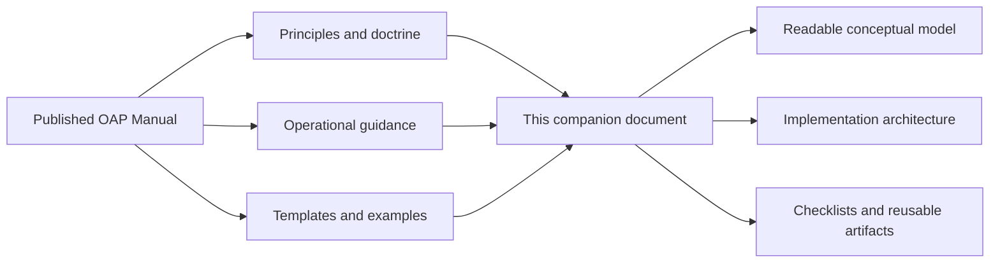

OAP can be implemented with different tools, models, operating systems, CI systems, and repository hosts. The method is defined by the **control structure and evidence discipline**, not by one vendor-specific command.

Several short **Field note** boxes in this edition are drawn from August 2026 SLAIF OAP runs across `slaif-agent-site`, `slaif-local-coding`, `slaif-api-gateway`, and `slaif-zap-it`. They are operational examples, not benchmark results or claims that every project will behave the same way. Quotations have been lightly edited only where necessary for readability.

---

## 2. Why OAP exists

### 2.1 The software-development loop has widened

AI-assisted software development has progressed through several increasingly large control loops. Code completion suggests a local continuation. Pair-programming assistants explain or edit nearby code. Chat-based coding can generate files and designs. Coding agents can inspect repositories, run commands, install dependencies, and submit pull requests.

Once an agent can operate a repository, the central engineering question changes. The problem is no longer simply:

> Can the model write the code?

It becomes:

> Who defines the system, who constrains the agent, what proves the result, where does durable truth live, who judges risk, and who decides that the software is ready?

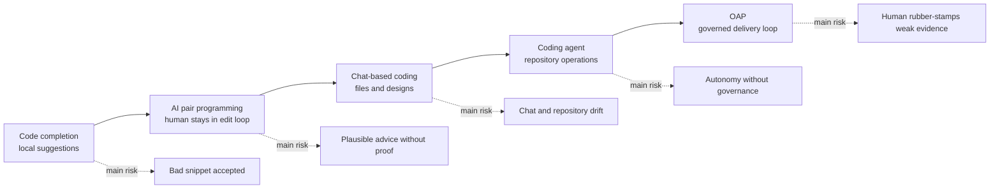

OAP belongs to the final stage. It treats AI coding as part of a larger management and assurance system.

### 2.2 Code production is becoming cheap; proof is not

Agents can produce implementation faster than humans can validate it. This shifts the bottleneck from typing to:

- deciding what should exist;
- preserving architectural intent;
- controlling scope;
- testing meaningful behavior;
- identifying negative paths;
- reviewing security and data handling;
- keeping documentation honest;
- distinguishing partial implementation from supported behavior;
- deciding whether a release claim is justified.

OAP therefore treats **validation debt** as the dominant debt of AI-accelerated development.

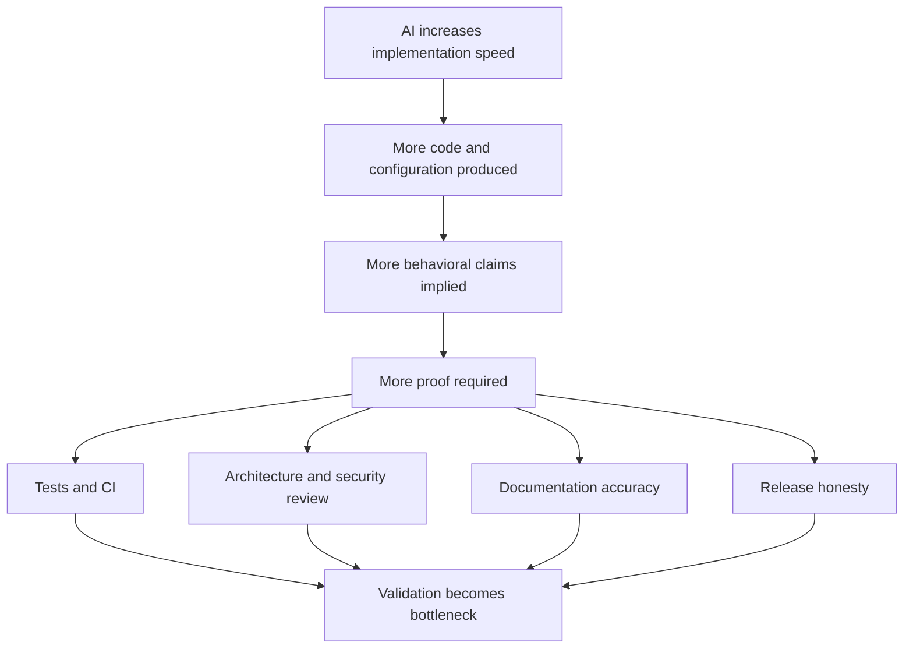

OAP is thus not primarily a productivity trick. It is a **validation-management method** designed for an era in which implementation capacity can exceed human review capacity.

### 2.3 OAP is a control system

OAP keeps human attention at the level where it has the highest leverage: product meaning, domain correctness, risk, evidence, and release. It delegates mechanical implementation labor to an execution agent but inserts a strategic reasoning layer before and after execution.

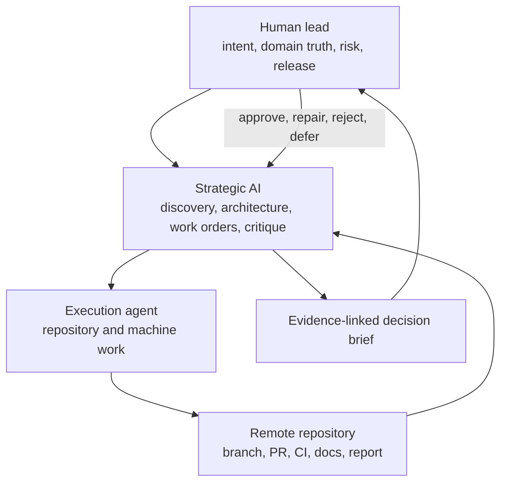

The loop is governed because no layer is expected to do everything:

- the human does not become the agent's terminal operator;
- the strategic model does not become the routine implementer;
- the execution agent does not define product meaning or release readiness;
- the local machine does not become the source of truth.

---

## 3. Working definition

### 3.1 Definition

**Orchestrated Agentic Programming is a human-governed software-delivery workflow in which a strategic AI converts domain intent into architecture, machine-readable governance, bounded work orders, critique, and evidence-linked recommendations, while a high-autonomy execution agent performs implementation work in a bounded runtime and returns changes through reviewable repository artifacts.**

The human lead remains accountable for:

- the problem definition;
- product purpose;
- domain truth;
- user needs;
- ethical and legal boundaries;
- risk appetite;
- priorities;
- acceptance criteria;
- consequential merge and release decisions;
- responsibility when the result is wrong.

### 3.2 Why “orchestrated”

The work is not handed to an agent as one open-ended objective. It is decomposed into roles, artifacts, boundaries, work units, evidence requirements, and gates. Strategic reasoning and execution are deliberately separated. The process has a control plane, an execution plane, durable state, and explicit acceptance points.

### 3.3 Why “agentic”

The execution agent is allowed to act rather than merely suggest. Depending on the environment, it may:

- inspect and edit repository files;
- install packages and system dependencies;
- start local databases and services;
- run migrations against test environments;
- invoke test, lint, type-check, build, and browser tools;
- diagnose failures and iterate;
- create branches and commits;
- push changes and open pull requests;
- write implementation and verification reports.

The strategic AI is also agentic in a different sense: it investigates, compares architecture, checks repository state, writes work orders, reviews evidence, identifies repair work, and maintains continuity.

### 3.4 Why “programming”

Programming does not disappear. It moves upward. The system still consists of source code, tests, schemas, configuration, deployment logic, and documentation. The human increasingly programs:

- intent;
- architecture;
- constraints;
- process;
- evidence expectations;
- acceptance and release criteria.

The agents translate that higher-level program into operational work.

### 3.5 What OAP is not

OAP is not:

- **vibe coding**, where results are accepted primarily because they look plausible;
- **ordinary AI pair programming**, where the human remains inside the implementation loop;
- **one enormous autonomous prompt**, with no PR boundaries or evidence contract;
- **an open-ended agent swarm**, in which authority and responsibility are unclear;
- **fully autonomous software engineering**, because human ownership of intent, risk, and release remains;
- **automation theater**, where generated reports substitute for actual repository and CI evidence.

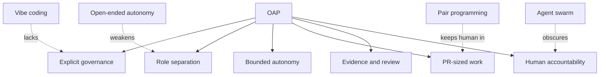

---

## 4. Roles and authority

### 4.1 The human lead

The human lead is not expected to type most of the code or relay every error message. The human is expected to govern the project.

The human lead owns:

- why the project exists;
- which users and workflows matter;
- what trade-offs are acceptable;
- which risks are tolerable;
- what the first release should and should not do;
- which evidence is sufficient;
- whether the result is useful and safe enough;
- whether a merge, release, or deployment is authorized.

The best human lead may therefore be the person who understands the domain most deeply, not necessarily the person who can implement every component manually.

### 4.2 The strategic AI

The strategic AI is the human-facing control plane. It should usually be the strongest practical model available for the project because its context must preserve:

- product intent and vocabulary;
- architecture and trust boundaries;
- previous decisions;
- current repository state;
- open risks;
- work-order history;
- review evidence;
- release status;
- human priorities and corrections.

Its responsibilities include:

- strategic discovery;
- architecture and technology selection;
- constitution drafting and maintenance;
- decomposition into PR-sized work;
- work-order authorship;
- review of execution reports, diffs, and CI;
- detection of scope creep and weak evidence;
- repair-order generation;
- concise decision material for the human;
- continuity and handoff creation.

It is the default first reviewer, but not the final accountable authority.

### 4.3 The execution agent

The execution agent is bounded, disposable implementation labor. It should have enough authority inside its runtime to complete work without using the human as a package installer, terminal relay, or debugging assistant.

It owns:

- repository inspection relevant to the order;
- code and test changes;
- local dependency and tool setup inside the permitted runtime;
- focused verification;
- branch, commit, push, and PR creation;
- accurate reporting of what passed, failed, was skipped, or remained blocked.

It does not own:

- product purpose;
- architecture changes outside the order;
- release claims;
- production credentials or production data;
- permission to merge its own PR unless an explicitly different governance model is adopted;
- permission to redefine acceptance criteria after implementation becomes difficult.

### 4.4 The repository and CI

The remote repository is not a passive storage location. It is the durable coordination substrate:

- commits preserve exact changes;
- branches isolate work;
- PRs expose scope and discussion;
- CI reproduces verification;
- review comments preserve critique;
- docs preserve current contracts;
- issues and handoffs preserve continuity;
- tags and releases preserve claims.

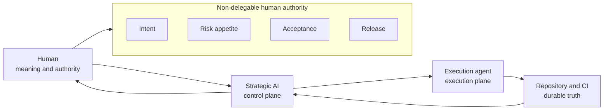

### 4.5 The anti-pilot rule

A compact OAP rule is:

> **The human pilots the strategic AI; the strategic AI directs the execution agent; the execution agent operates the machine.**

If the execution agent repeatedly asks the human to install packages, run commands, paste logs, repair the environment, or decide routine implementation details, the control loop has inverted.

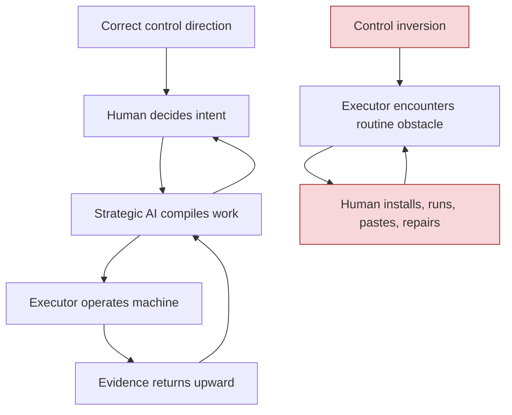

The remedy is normally better runtime design, clearer work orders, or stronger strategic mediation—not more human terminal labor.

---

## 5. Strategic discovery

### 5.1 Begin with the domain problem, not a stack

OAP starts before implementation. The first strategic conversation asks what kind of system should exist.

A human may know the operational need precisely while not knowing the best architecture. Strategic discovery helps determine:

- the actual product category;
- intended users and workflows;
- trust boundaries;
- threat and failure models;
- data ownership and retention;
- required interfaces;
- suitable, boring, maintainable technologies;
- background jobs and operational processes;
- deployment shape;
- testing strategy;
- what must be excluded from the first release;
- what the execution agent must never improvise.

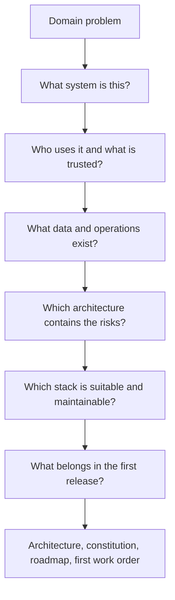

The human does not need to know every technical answer in advance. The human must know the domain well enough to reject a technically elegant but operationally wrong answer.

### 5.2 Discovery is collaborative judgment

The strategic model proposes alternatives and explains consequences. The human accepts, rejects, or redirects. This is not a one-shot model output.

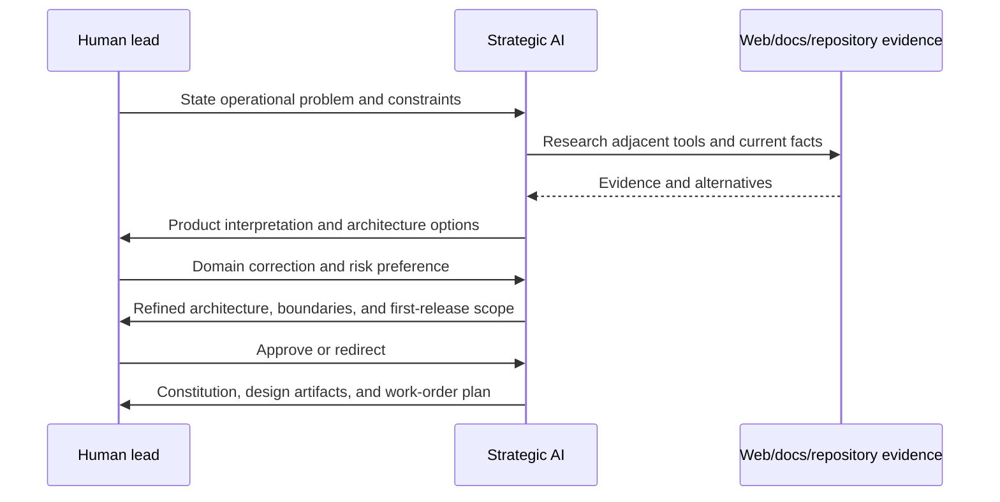

### 5.3 Discovery artifacts

A serious discovery phase should produce durable artifacts, not only chat history. Depending on project size, these may include:

- `ARCHITECTURE.md`;
- a trust-boundary or security model;
- an API or data-contract document;
- a release-scope definition;
- a roadmap;
- architecture decision records;
- a project constitution such as `AGENTS.md`;
- initial work orders;
- test and evidence expectations.

The strategic conversation has succeeded when another competent agent can understand the intended system without reconstructing the human's entire chat history.

### 5.4 Discovery gate

Broad execution should not begin until the project has enough definition to constrain useful work.

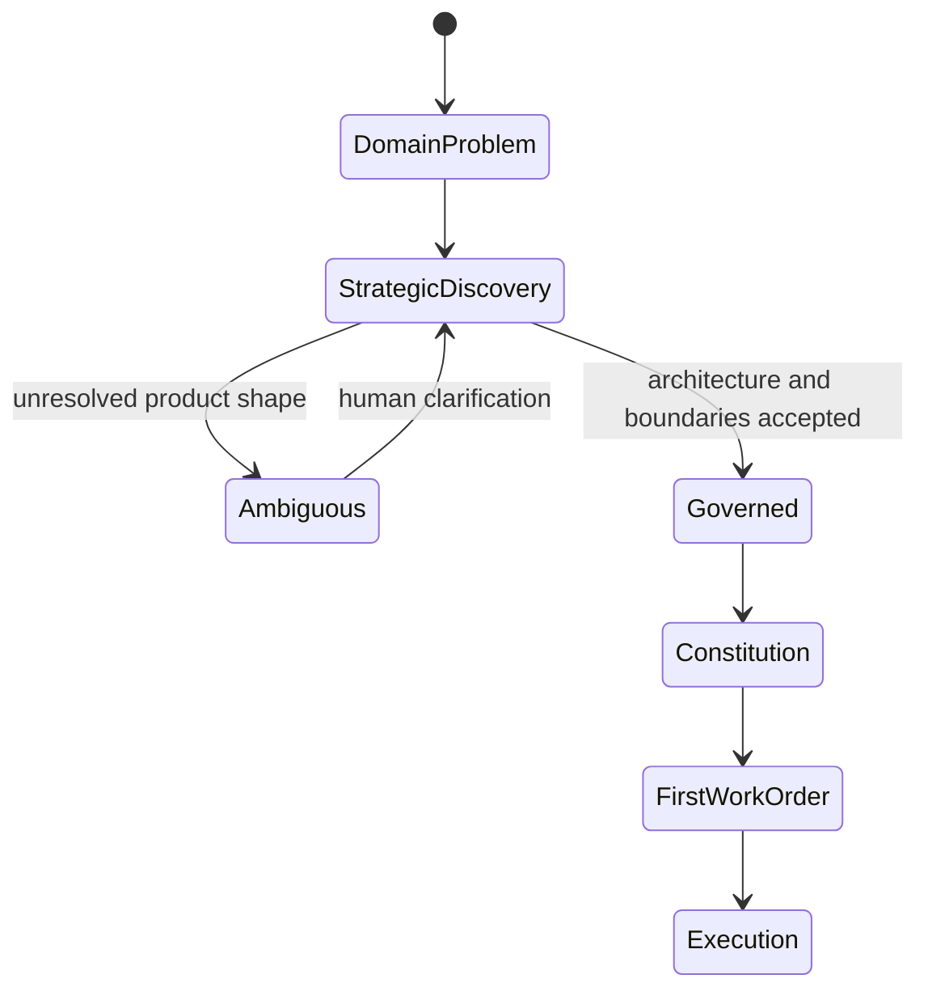

This does not require perfect foresight. It requires enough explicit law that the executor is not inventing the product while writing it.

---

## 6. The project constitution

### 6.1 Machine-readable governance

The project constitution—often `AGENTS.md`, `CLAUDE.md`, or an equivalent instruction file—turns repeated human correction into durable operational law. It tells agents how to behave when the human is not watching.

Without a constitution, a project becomes a sequence of clever prompts. With a constitution, every work order inherits stable rules.

### 6.2 What the constitution should contain

A useful constitution normally defines:

- project purpose and non-purpose;
- architectural boundaries;
- source-of-truth rules;
- repository workflow;
- branch and PR requirements;
- testing and verification commands;
- security and privacy rules;
- prohibited actions;
- dependency policy;
- documentation obligations;
- reporting vocabulary;
- definition of done;
- escalation conditions;
- role boundaries and merge authority.

It should distinguish:

- **normative law**: what agents must or must not do;
- **architecture**: how the system is intended to work;
- **procedure**: exact commands or workflows;
- **reference material**: explanations and examples.

### 6.3 Layered constitutions

Larger repositories may need layered instructions. Root law applies to the whole project; subtree law refines it for a language, service, frontend, data layer, or deployment component.

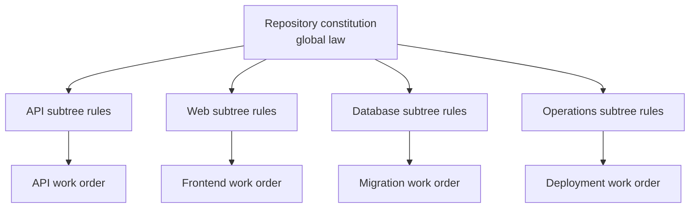

Local instructions may add constraints but should not silently weaken higher-level security, source-of-truth, or authority rules.

### 6.4 Constitution as memory

The constitution is a memory mechanism. Models lose context, sessions end, and team members change. Durable instructions preserve:

- recurring corrections;
- architectural invariants;
- known dangerous shortcuts;
- exact test expectations;
- workflow conventions;
- the meaning of “done.”

The constitution should remain concise enough to be loaded reliably. Deeper explanation belongs in linked architecture and runbook documents.

### 6.5 Constitution smell tests

A constitution is weak if it:

- contains only generic advice such as “write clean code”;
- duplicates long documentation without identifying normative rules;
- contradicts current repository behavior;
- fails to name exact test commands;
- omits source-of-truth and branch policy;
- lets the agent redefine scope or acceptance criteria;
- gives broad warnings without concrete forbidden actions;
- becomes so long and stale that agents cannot identify what is binding.

A strong constitution lets the strategic model answer:

> What project law constrains this work order?

and lets the executor answer:

> What must remain true while I implement it?

---

## 7. Operational preflight and the runtime boundary

### 7.1 Autonomy is a runtime design decision

An agent that can edit code but cannot install a missing dependency, start a test database, or run the real test suite is not meaningfully autonomous. It may instead recruit the human for mechanical work.

OAP can use cautious approval modes, but its distinctive high-autonomy form places power inside a deliberately bounded and rebuildable runtime.

### 7.2 The bounded high-autonomy pattern

The preferred pattern is:

- dedicated VM, WSL2 distribution, container, devcontainer, or cloud sandbox;
- only the intended repository and test fixtures;
- enough privilege to install, build, test, and run local services;
- no production secrets;
- no production data;
- no irreplaceable state;
- narrow host mounts;
- version-control visibility for all durable changes;
- PRs rather than direct mutation of protected branches;
- snapshot, export, or rebuild path;
- logs sufficient for diagnosis.

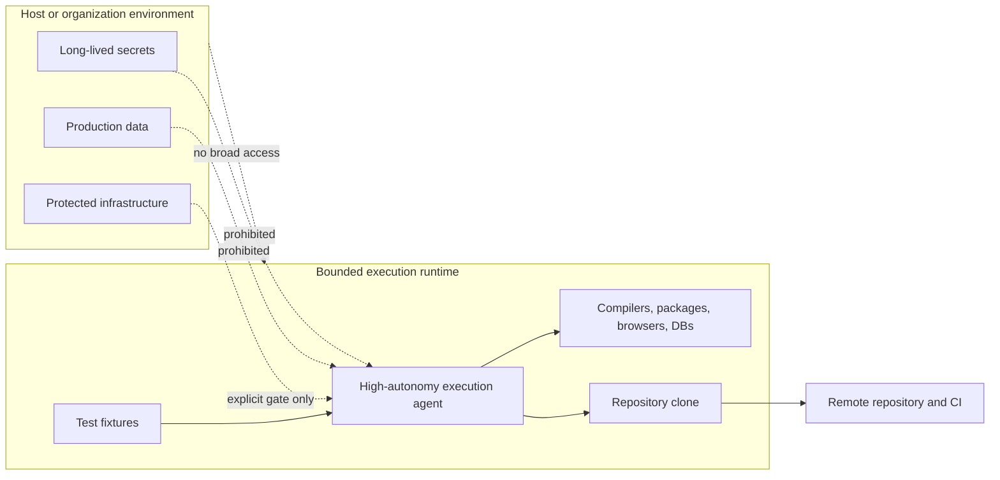

### 7.3 Privilege is also an efficiency boundary

The question is not merely “how little can the agent do?” It is:

> What can the agent safely do inside a space we are willing to throw away?

Passwordless administrative privilege may be acceptable inside a disposable guest containing no valuable secrets or state. The same privilege on a normal workstation with broad home-directory access may be unacceptable.

The boundary should be designed so that routine setup is cheaper for the agent than for the human.

### 7.4 Isolation and approval are different controls

OAP distinguishes:

- **runtime capability**: what the agent can technically reach or modify;
- **process authority**: what the agent is permitted to accept, merge, release, or deploy.

A sandbox can prevent an action. A governance gate can forbid acceptance even when the action is technically possible.

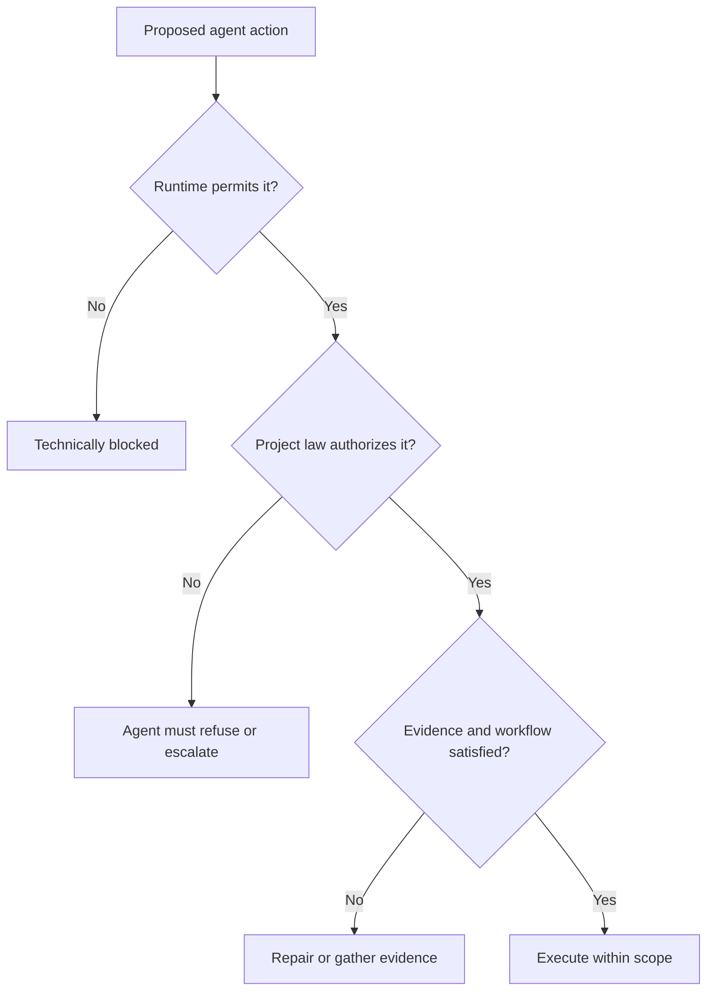

### 7.5 Reset must be cheap

The runtime is not safely disposable if rebuilding it takes days and depends on undocumented manual knowledge.

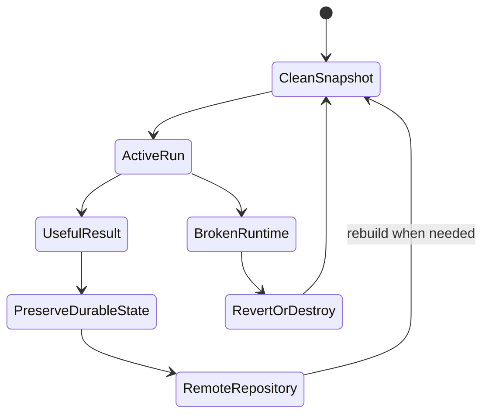

After useful work, preserve commits, PRs, logs, and documented setup. After destructive failure, revert or rebuild rather than nursing an irreplaceable agent workstation.

### 7.6 Preflight checklist

Before high-autonomy execution, verify at minimum:

- [ ] The agent runs in a dedicated and understood environment.
- [ ] The repository is inside that environment or a narrow writable mount.
- [ ] Host home directories are not broadly writable from the guest.
- [ ] Production SSH, cloud, Kubernetes, Docker, browser, and password-store credentials are absent.
- [ ] Production `.env` files and customer data are absent.
- [ ] Guest-local credentials are least-privilege and replaceable.
- [ ] Network reachability is understood.
- [ ] Snapshot, export, checkpoint, or rebuild procedure exists.
- [ ] The Git tree is clean or deliberately known dirty.
- [ ] Logs are available.
- [ ] The agent cannot silently merge to protected branches.
- [ ] Recovery has been tested at least once.

The governing principle is:

> **The agent may be powerful inside the guest, but the guest must not contain anything the human cannot afford to lose or rotate.**

---

## 8. Work-order engineering

### 8.1 The work order is the strategic layer's executable product

The strategic AI's most important output is usually not code. It is a work order that converts human and architectural intent into a bounded implementation contract.

A good work order allows the executor to act without:

- inventing the product;
- asking the human for routine setup;
- widening scope because neighboring work seems useful;
- redefining success when tests become difficult;
- reconstructing stale project state from old chat memory.

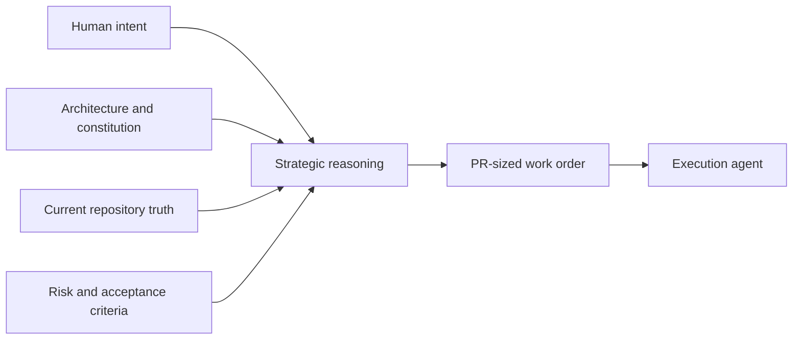

### 8.2 Required content

A strong work order normally includes:

- governing instructions;
- current verified state;
- exact goal;
- domain behavior to preserve;
- scope;
- explicit non-goals;
- files or subsystems to inspect;
- required behavior and invariants;
- tests to add and commands to run;
- allowed local setup;
- security and data-handling restrictions;
- documentation updates;
- branch, commit, and PR workflow;
- exact final-report format.

### 8.3 Current state must be current

The strategic model must verify live repository state before issuing work. A handoff or previous report is a memory aid, not authority.

Before drafting an order, check as appropriate:

- remote default branch and head SHA;
- open PRs;
- recent merges;
- current CI;
- relevant files and tests;
- unresolved review comments;
- existing migrations or API contracts;
- local dirty state that must not be overwritten.

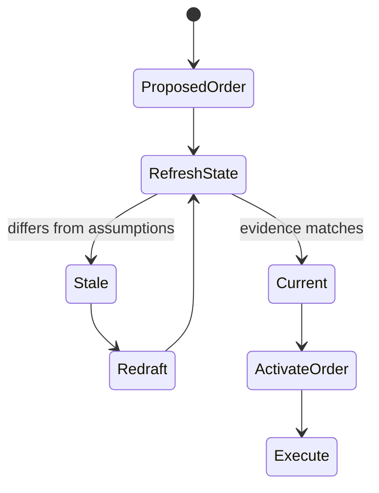

### 8.4 Non-goals are safety tools

Agents are trained to be helpful. Without explicit non-goals, helpfulness becomes scope creep.

Useful non-goals name concrete boundaries:

- do not add a migration;
- do not change the public API;
- do not add a dependency;
- do not store raw prompts or payloads;
- do not call real external services;
- do not touch unrelated files;
- do not claim production readiness;
- do not treat skipped browser tests as passed.

### 8.5 Tests must be named

“Run tests” is weak. A work order should name:

- focused commands;
- relevant broader suites;
- expected negative tests;
- environment assumptions;
- what may be skipped and how it must be reported;
- CI checks expected at the final PR head.

### 8.6 Repair work is not a new feature

When a PR has failing CI, unresolved review comments, weak tests, security concerns, or documentation drift, the next order should repair that PR rather than start adjacent work.

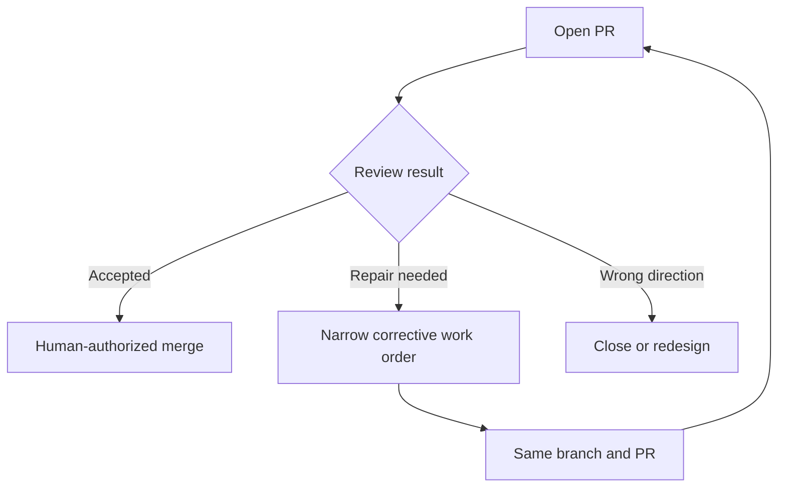

> **Field note — The corrective round stayed on the same PR.**
>
> During Agent-Site objective 066, a production-style Compose run found that the Agent application worked but the public NGINX health alias returned `404`. The strategic agent did not invent a new feature, open a replacement PR, or start the next objective. It issued a narrowly bounded `066-d` correction on the same branch and PR, prohibited changes to authentication and database authority, and required the deployed `200/401/404` edge behavior to be proved.
>
> **Operational lesson:** a genuine defect discovered during review belongs to the smallest corrective round that closes the existing PR. Repair is continuation, not feature creation.

### 8.7 Work-order template

```markdown
# Work Order — <identifier>

## Governing instructions
- Read the project constitution first.
- Follow repository workflow and source-of-truth rules.
- If live state differs from this order, stop mutation and report the difference.

## Current verified state
- Default branch and head:
- Relevant open PRs:
- Relevant implemented behavior:
- Known failing or skipped checks:

## Goal
- Exact outcome in domain language.

## Scope
- Required implementation work.

## Non-goals
- Explicitly excluded work, files, APIs, migrations, dependencies, or claims.

## Files and systems to inspect
- ...

## Required behavior and invariants
- ...

## Verification
- Tests to add:
- Commands to run:
- Required negative paths:
- Required final-head CI:

## Local setup allowed
- Install missing test tools inside the bounded runtime when required.
- Document setup performed.
- Do not ask the human to perform routine setup unless a named safety boundary blocks it.

## Documentation required
- ...

## Git and PR workflow
- Start from current default branch.
- Create or use the named feature branch.
- Commit only related changes.
- Push and open/update the PR.
- Do not merge.

## Final report
- Branch and implementation commit.
- PR URL.
- Summary of behavior.
- Files changed.
- Tests and exact results.
- Setup performed.
- Documentation changed.
- Risks, failures, skipped checks, and unresolved questions.
```

### 8.8 Prompt smells

A work order is weak if it says:

- “make this better”;
- “finish the feature”;
- “fix all issues”;
- “use your judgment” without constraints;
- “run tests” without naming evidence;
- “update docs” without naming the contract;
- “ask me if anything is missing” for routine environment work.

A strong order allows success or failure to be determined before execution begins.

### 8.9 Work-order provenance and proof-sized scope

Every work order should be traceable to a durable reason. A compact provenance vocabulary is enough:

| Marker | Origin of the work |
|---|---|
| **H** | Explicit human instruction or preloaded intent |
| **A** | Architecture, constitution, contract, or roadmap requirement |
| **E** | Observed failing evidence or runtime discrepancy |
| **I** | Independent audit finding |
| **R** | Remediation of a recorded risk, review finding, or failed acceptance gate |

An order may have several markers. The purpose is not bureaucracy. It is to answer one question before an autonomous system spends another implementation cycle:

> **Why does this work exist?**

The strategic layer should also choose the smallest coherent slice that proves the mechanism. Understanding the eventual architecture does not require implementing the whole architecture in the next PR.

> **Field note — The 26-point design that became one proving PR.**
>
> A discussion about preserving long governance context quickly expanded into a comprehensive cache architecture. The human interrupted, in substance: *“Do not give me a 26-point specification. First tell me what can reasonably be built quickly with OAP.”* The resulting plan was reduced to one PR that proved a single reinjection path, with explicit exclusions for generalized caching, automatic observation, daemons, databases, and production packaging.
>
> **Operational lesson:** first prove the mechanism at one real boundary. Generalize only after the evidence justifies another work order.

---

## 9. The execution layer and PR-sized delegation

### 9.1 One task, one context

Execution context burns quickly. The coding agent reads files, command output, logs, test failures, and implementation details. OAP therefore treats one PR-sized task as the natural lifespan of an execution context. If a context or process must be replaced before the task finishes, the fresh execution episode resumes the same work order, branch, and PR; context rollover is not a new objective.

The strategic context should preserve the project; the execution context should finish one bounded change.

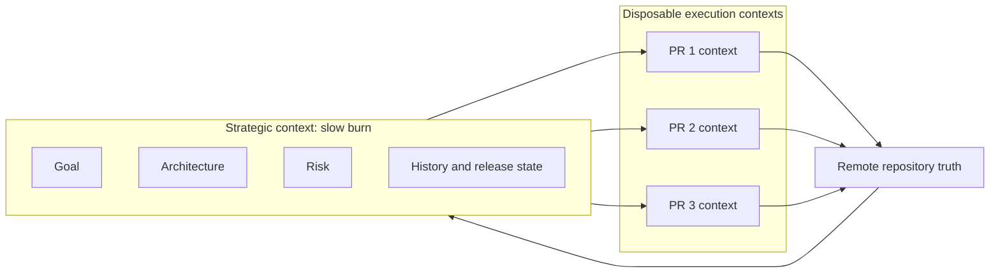

### 9.2 Why the PR is the unit

A PR-sized unit is:

- large enough to implement useful behavior;
- small enough to review and revert;
- bounded enough for one execution context;
- explicit enough to test;
- visible enough to audit;
- durable enough to become project history.

A giant task obscures causality. A tiny command-by-command task recruits the human into implementation. The PR is the middle-sized management unit.

### 9.3 Executor workflow

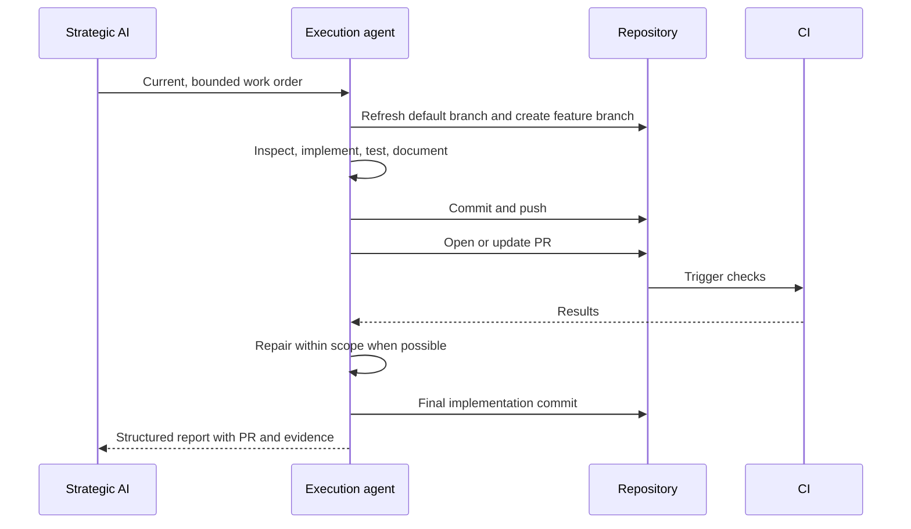

### 9.4 Executor discipline

The executor must:

- obey the active scope;
- keep unrelated changes out;
- preserve local work it does not own;
- distinguish current facts from assumptions;
- run the named verification;
- report exact outcomes;
- avoid weakening tests or validation to manufacture success;
- update documentation when behavior changes;
- leave the work reviewable;
- avoid merging its own PR under normal OAP authority.

### 9.5 The execution report is an interface

The final report is not narrative decoration. It is the interface between execution and strategy.

It must distinguish:

- **passed**;
- **failed**;
- **skipped**;
- **not run**;
- **blocked**;
- **out of scope**.

“All tests passed” is valid only when the relevant requested suite literally passed. “Focused unit tests passed; integration tests were not run because the service fixture is unavailable” is more useful and more honest.

### 9.6 Execution-report template

```markdown
# Execution Report — <work-order identifier>

## Result
- COMPLETE / PARTIAL / BLOCKED / FAILED

## Git state
- Branch:
- Implementation commit:
- PR URL:
- Base branch and relevant head:

## Implemented
- ...

## Files changed
- `path`: reason

## Verification
| Command or check | Result | Evidence or limitation |
|---|---|---|
| ... | PASS / FAIL / SKIPPED / NOT RUN / BLOCKED | ... |

## Negative paths verified
- ...

## Local setup performed
- Packages, browsers, databases, services, or configuration added inside the execution runtime.

## Documentation
- Updated:
- Not affected:

## Risks and unresolved items
- ...

## Scope confirmation
- Unrelated files changed: NO / explain
- Production credentials or data used: NO / explain
- Required checks skipped: NO / list exactly
```

---

## 10. Verification as evidence

### 10.1 Tests are evidence, not ritual

A test suite is valuable only insofar as it supports the claim being made. Agents can easily generate tests that assert their own implementation details while missing the actual risk.

For every important claim, ask:

- What observable behavior proves it?
- What negative path would disprove it?
- Would the test have failed before the change?
- Is the mock placed at the correct boundary?
- Does the test exercise authorization, persistence, error handling, or concurrency when those are the risk?

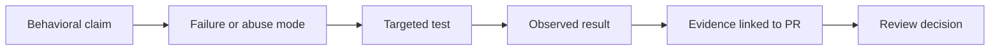

### 10.2 Boundary-faithful verification

A passing test supports a claim only when it exercises the boundary named by that claim. Verification must preserve the relevant production properties:

- real entry point rather than a test-only factory path;
- real authority or credential class rather than a convenient substitute;
- real persistence boundary when persistence is the claim;
- real routing layer when edge behavior is the claim;
- real concurrency, rollback, or isolation mechanism when that is the risk;
- real integrated configuration when deployment readiness is being asserted.

Mocks remain useful, but they must be placed outside the boundary under test. A test that replaces the very object, identity, or process whose behavior is being claimed can be green while proving a different system.

> **Field note — Green was not enough.**
>
> Agent-Site capability-authentication work initially appeared successful. Strategic review rejected one version because the test replaced production database state with a convenient object that the real process did not use. A later version was rejected again after review found that the deployed Agent API would use the wrong database authority and that its actual module entry point still launched a health-only runner. The tests were not false; they were faithful to the wrong execution path.
>
> **Operational rule:** do not ask only whether the tests are green. Ask whether the green tests prove the claimed system.

### 10.3 Positive and negative evidence

A positive test proves that expected behavior can work. A negative test proves that unsafe or invalid behavior is rejected.

Examples:

- successful request **and** unauthorized request denied;
- valid migration **and** rollback/failure path;
- accepted input **and** oversized or malformed input rejected;
- provider forwarding **and** proof that forbidden requests never reach upstream;
- successful deletion **and** version/conflict protection;
- valid configuration **and** unsafe configuration refused.

### 10.4 Verification layers

```mermaid
flowchart TB
    U[Unit tests<br/>local logic] --> I[Integration tests<br/>component contracts]
    I --> E[E2E and browser tests<br/>real workflows]
    E --> O[Operational tests<br/>backup, restore, upgrade, rollback]
    O --> A[Audit and release verification]

    S[Static checks<br/>lint, types, secret scan, dependency scan] --> U
    C[CI reproducibility] --> A
```

Not every PR needs every layer. The work order should identify the layer required by the claim.

### 10.5 CI is independent reproduction

Local tests are necessary but insufficient. CI provides:

- a fresh environment;
- consistent commands;
- independent execution at the pushed commit;
- visible logs;
- protected-branch integration;
- a stable merge gate.

Review must check the **final PR head**, not an earlier green commit.

### 10.6 Unknown remains unknown

OAP uses strict evidence vocabulary:

```mermaid
stateDiagram-v2
    [*] --> Planned
    Planned --> Passed: executed and succeeded
    Planned --> Failed: executed and failed
    Planned --> Skipped: deliberately omitted
    Planned --> NotRun: never executed
    Planned --> Blocked: prerequisite unavailable

    Skipped --> [*]
    NotRun --> [*]
    Blocked --> [*]
    Passed --> [*]
    Failed --> [*]
```

Only **Passed** supports a positive claim. Skipped, not run, and blocked are not failures in honesty—but they are not proof.

### 10.7 The first failing boundary and the minimum discriminating experiment

When an end-to-end path fails, identify the first boundary that demonstrably fails before changing product code. A failure above a component is not evidence that the component below it is defective.

```mermaid
flowchart TD
    START[Acceptance path starts] --> B1[Client or launcher]
    B1 --> B2[Sandbox or tool execution]
    B2 --> B3[Product adapter]
    B3 --> B4[Persistence, compiler, or model]
    B4 --> RESULT[Expected behavior]

    B2 -->|first reproducible failure| STOP[Stop product mutation]
    STOP --> EXP[Run the smallest experiment that distinguishes environment from product]
```

The strategic agent should choose the smallest experiment that splits the plausible hypotheses. Each diagnostic order needs an explicit stop condition so that investigation does not become an autonomous research project unrelated to the product milestone.

> **Field note — A human contradiction reopened a confident diagnosis.**
>
> During Local Coding objective 004, a raw Bubblewrap failure was interpreted as a host or kernel limitation. The human asked: *“If Codex works for me on the same machine, why does this failure not manifest normally?”* That contradiction forced the interpretation back open. A later corrective report narrowed the truth to: *“The first failure remains before the Local Coding boundary.”* The decisive experiment became a tiny branch: run the actual Codex policy with a harmless command; only after it succeeds, read the exact dependency and resume the governed E2E.
>
> The original observation remained valid. The causal label was too strong. OAP therefore preserves this rule: **keep the evidence; supersede the interpretation explicitly when later evidence demands it.**

### 10.8 Safety and hygiene checks

Security-sensitive changes may require named checks such as:

```bash
rg -n "api_key|Authorization|Bearer|password|secret|token" app tests docs
git diff --check
python -m pytest tests/unit
ruff check app tests
```

The exact commands depend on the stack. The principle is that checks are repeatable and tied to risks.

### 10.9 Avoiding unsafe helpfulness

Agents may try to make a task “work” by:

- disabling a failing test;
- loosening validation;
- adding a broad catch-all;
- mocking the wrong boundary;
- skipping a difficult integration path;
- using a real service because the fake is inconvenient;
- quietly changing the API;
- writing documentation that sounds more complete than the implementation.

The strategic reviewer must treat such shortcuts as evidence failures, not ingenuity.

---

## 11. Remote-repository truth and durable memory

### 11.1 The runtime is temporary; project truth is durable

OAP depends on a sharp separation:

```mermaid
flowchart TD
    subgraph Disposable[Disposable or reconstructable]
        VM[Execution VM]
        LOCAL[Local checkout]
        CACHE[Caches and generated state]
        SESSION[Agent session context]
    end

    subgraph Durable[Durable project truth]
        COMMITS[Remote commits]
        PRS[Pull requests and review]
        CI[CI logs and artifacts]
        DOCS[Documentation and runbooks]
        ISSUES[Issues, decisions, releases]
    end

    VM --> COMMITS
    LOCAL --> PRS
    SESSION --> DOCS
    CACHE -. not authoritative .-> Durable
```

A local branch can be abandoned. A VM can be rebuilt. A session can be lost. The project must still be reconstructable from remote, versioned artifacts.

### 11.2 Truth hierarchy

When sources disagree, prefer:

1. current remote repository and protected branch;
2. current PR diff and final-head CI;
3. current versioned architecture, constitution, tests, and docs;
4. issue and review history;
5. recent handoff;
6. chat or model memory.

A handoff that says a PR is open is stale after that PR has merged. A model remembering an old architecture is wrong when the accepted document changed.

### 11.3 Orchestration continuity law

An OAP role is a logical protocol participant, not a particular process, model, provider session, machine, or context window. Durable project state must allow a fresh process to resume the same role without inventing new work.

Therefore:

```text
process restart       != new objective
context reset         != new objective
model replacement     != new objective
provider replacement  != new objective
machine restart       != new objective

new strategic requirements after review
                    = new corrective order
```

Recovery begins by reconciling the repository, active order, branch, PR, reports, and CI. A completed report must not be replayed merely because a model session died; an incomplete order must resume at the first unfinished requirement on the same branch and PR.

```mermaid
flowchart LR
    LOST[Process or provider lost] --> DURABLE[Read GitHub and OAP transcript]
    DURABLE --> STATE{Final report already exists?}
    STATE -->|Yes| REVIEW[Resume strategic review]
    STATE -->|No| CONTINUE[Resume same coding order]
    REVIEW --> NEXT[Merge, repair, or next objective]
    CONTINUE --> SAME[Same branch and PR]
```

> **Field note — The process died; the work order did not.**
>
> Over one weekend, coding processes died after consuming FIFO signals, providers failed, models were changed, and strategic sessions became non-resumable. The successful recovery instruction was concise: *“GitHub is software truth; OAP files are orchestration truth; process/session memory is disposable.”* Fresh agents reconstructed the active protocol state instead of recreating completed PRs or renumbering work solely because the previous “brain” disappeared.

### 11.4 Documentation as operational memory

A mature project may need:

- README and quickstart;
- architecture overview;
- security model;
- API and compatibility matrix;
- deployment and operations guide;
- testing guide;
- runbooks;
- release notes;
- review and audit archive;
- remediation matrix;
- strategic handoffs.

Documentation must track behavior. If an endpoint is partial, docs must not call it fully compatible. If recovery has not been tested, the runbook must not promise it.

### 11.5 Strategic handoffs

Handoffs are written for the next strategic session. They should be concise and evidence-linked.

```markdown
# Project Handoff

## Current repository truth
- Default branch and head:
- Open PRs:
- Recently merged PRs:
- Current CI status:

## Product and milestone
- Goal:
- Current release target:

## Implemented
- ...

## Missing or blocked
- ...

## Non-negotiable rules
- ...

## Known risks
- ...

## Next recommended task
- ...

## Do not do next
- ...
```

```mermaid
flowchart LR
    S1[Strategic session 1] --> H[Versioned handoff]
    H --> VERIFY[Verify live repository]
    VERIFY --> S2[Strategic session 2]
    S2 --> ORDER[Next work order]
    ORDER --> REPO[Repository evidence]
    REPO --> H2[Updated handoff]
```

The handoff reduces context reload cost but never overrides live repository truth.

---

## 12. Strategic review and human evidence interrogation

### 12.1 Review is where OAP becomes engineering

Without serious review, OAP collapses into automation theater. The execution agent can produce a polished report and green focused tests while solving the wrong problem, touching too much scope, or hiding an untested boundary.

The strategic AI reviews:

- goal match;
- diff scope;
- architecture preservation;
- test quality;
- negative-path coverage;
- skipped and blocked checks;
- dependency changes;
- security and data handling;
- documentation accuracy;
- operator and migration impact;
- whether repair is required.

### 12.2 Evidence interrogation

The human normally interacts through compressed strategic material, then drills down where needed.

Useful questions include:

- Did the PR implement the exact requirement?
- Which files enforce the invariant?
- Which test proves the critical behavior?
- What negative path was tested?
- What was not tested?
- Did any real credential or production-like data enter the runtime?
- Did the agent add a dependency or migration?
- Does documentation overclaim?
- What would make you reject this PR?
- What are you least confident about?

```mermaid
sequenceDiagram
    participant E as Execution agent
    participant G as GitHub and CI
    participant S as Strategic AI
    participant H as Human lead

    E->>G: PR, commits, report, tests
    G-->>S: Diff, final-head CI, review state
    S->>S: Map claims to evidence and risks
    S->>H: Short decision brief
    H->>S: Ask targeted adversarial questions
    S->>G: Retrieve exact evidence
    G-->>S: Files, logs, checks, comments
    S->>H: Grounded answer and recommendation
    H->>S: Merge, repair, reject, or defer
```

### 12.3 The decision brief

```markdown
## Decision Brief

**Recommendation:** MERGE / REPAIR / REJECT / DEFER

### Goal match
- ...

### Evidence
- Test command and result:
- CI result at final head:
- Key files and invariants:
- Documentation changed:

### Scope
- Expected changes:
- Unexpected or unrelated changes:

### Risks and uncertainty
- ...

### Missing or skipped evidence
- ...

### Human decision needed
- ...
```

The brief should be short enough to read quickly and precise enough to support drill-down.

### 12.4 Review outcomes

```mermaid
stateDiagram-v2
    [*] --> UnderReview
    UnderReview --> MergeRecommended: goal met and evidence sufficient
    UnderReview --> RepairRequired: bounded defects or missing evidence
    UnderReview --> Reject: wrong direction or unacceptable risk
    UnderReview --> Defer: external decision or prerequisite pending
    RepairRequired --> UnderReview: same PR repaired and rechecked
    MergeRecommended --> HumanDecision
    HumanDecision --> Merged: human authorizes
    HumanDecision --> RepairRequired: human requests changes
    HumanDecision --> Reject
```

### 12.5 Targeted human inspection

OAP does not prohibit line-by-line human review. It makes it **risk-directed** rather than the default bottleneck.

Deep manual inspection is appropriate for:

- authentication and authorization;
- cryptography and credential flow;
- irreversible data changes;
- security-definer database functions;
- migrations and rollback;
- network and SSRF boundaries;
- public exposure;
- suspicious or overly broad diffs;
- weak or contradictory evidence.

---

## 13. Audit and remediation

### 13.1 Audit is normal

External critique is not evidence that OAP failed. It is part of mature OAP because strategic and execution models can share blind spots.

Auditors may be:

- another model;
- a security scanner;
- a dependency or license scanner;
- a human specialist;
- a clean-room test harness;
- an operator performing a fresh install;
- a separate team reviewing release claims.

### 13.2 Audit levels

```mermaid
flowchart TB
    L1[Level 1<br/>strategic review of report and CI] --> L2[Level 2<br/>targeted diff and test inspection]
    L2 --> L3[Level 3<br/>independent model or tool audit]
    L3 --> L4[Level 4<br/>human specialist review]
    L4 --> L5[Level 5<br/>clean-environment release qualification]
```

The required level depends on risk, not project vanity.

### 13.3 Remediation matrix

Audit findings should become trackable work rather than prose that disappears.

| Finding | Severity | Evidence | Owner | Required action | Verification | Status |
|---|---:|---|---|---|---|---|
| Example | High | Link to scanner/test | Strategic/coding/human | Exact change | Exact command/check | Open |

### 13.4 Audit loop

```mermaid
flowchart LR
    BUILD[Implemented PRs] --> AUDIT[Independent audit]
    AUDIT --> FIND{Findings?}
    FIND -->|No material findings| READY[Readiness evidence]
    FIND -->|Yes| MATRIX[Remediation matrix]
    MATRIX --> ORDER[Repair work orders]
    ORDER --> PR[Repair PRs and CI]
    PR --> AUDIT
```

Findings are closed only with evidence. “Addressed” without a changed artifact and verification is not closure.

### 13.5 Independent Closure Audit

The agent that planned, executed, reviewed, and summarized a long milestone must not be the sole authority for certifying that the milestone is complete. Before declaring an architecture-defined milestone such as MVP complete, OAP should run an **Independent Closure Audit (ICA)**.

The audit starts from human-owned scope and accepted architecture, not from the completed work-order list:

```mermaid
flowchart TD
    ARCH[Architecture and human milestone definition] --> MATRIX[Requirement-by-requirement matrix]
    MAIN[Current merged main] --> MATRIX
    TESTS[Boundary-faithful executable evidence] --> MATRIX
    REPORTS[Agent reports and README claims] -. claims only .-> MATRIX
    MATRIX --> CLASS{Implemented, partial, absent, or unproven?}
    CLASS -->|gaps| ORDERS[New bounded closure orders]
    ORDERS --> MAIN
    CLASS -->|coverage proven| GATE[Milestone decision gate]
    MAIN --> REAUDIT[Repeat ICA after remediation]
    REAUDIT --> MATRIX
```

A closure queue is not proof that it covers the architecture. After the queue is completed, repeat the audit; otherwise a well-executed plan can still omit requirements that never entered the plan.

> **Field note — “Do not trust the agents.”**
>
> During an Agent-Site weekend run, the surrounding autonomous evidence trail had converged on a “100% MVP” characterization. The human ordered a fresh architecture-versus-current-`main` audit with the instruction: *“Do not trust the agents.”* The hostile audit treated PR prose, reports, README percentages, and green-check summaries as claims until source and runtime paths substantiated them. It found defining product paths that were stubbed, synthetic, or unwired and revised the informal completeness estimate to roughly 40 percent. A subsequent closure plan was useful, but review then noticed that even that plan might omit contractual MCP, media, reconstruction, and visual targets.
>
> **Operational rule:** a strategic agent may recommend milestone closure, but the milestone must survive an architecture-to-implementation audit that does not begin from the agent's own conclusion.

---

## 14. Merge, release, and human authority

### 14.1 Merge and release are different decisions

A PR can be correct within its scope without making the product ready for production. OAP separates:

- **change acceptance**: is this PR good enough to merge?
- **release readiness**: is the integrated system ready to be claimed and operated at the target level?
- **deployment authorization**: may the system cross into the target environment?

### 14.2 Human approval gates

Human approval is normally required for:

- merge to protected branches;
- production deployment;
- destructive data operations;
- credential rotation;
- public release claims;
- adding risky dependencies;
- widening network access;
- changing security posture.

Projects may add further gates for regulated data, cost exposure, legal terms, or irreversible migrations.

```mermaid
flowchart TD
    PR[PR complete] --> REVIEW[Strategic review]
    REVIEW --> CI{Final-head checks green?}
    CI -->|No| REPAIR[Repair]
    REPAIR --> PR
    CI -->|Yes| HM{Human merge decision}
    HM -->|No| REPAIR
    HM -->|Yes| MAIN[Merged to main]
    MAIN --> QUAL[Integrated release qualification]
    QUAL --> HR{Human release decision}
    HR -->|Not ready| HARDEN[Hardening and remediation]
    HARDEN --> QUAL
    HR -->|Ready| HD{Human deployment authorization}
    HD -->|Yes| DEPLOY[Deploy]
```

### 14.3 Honest readiness language

OAP rejects readiness inflation:

- “implemented” does not necessarily mean “supported”;
- “focused tests passed” does not mean “fully tested”;
- “demo works” does not mean “production ready”;
- “release candidate” does not mean “security certified”;
- “no known failures” does not mean “all failure modes tested.”

Documentation, release notes, and decision briefs must describe actual scope.

### 14.4 Release evidence

A serious release decision may require:

- all required CI green at the release commit;
- final verification harness;
- clean-clone installation;
- upgrade and rollback evidence;
- backup and restore evidence;
- dependency and secret scans;
- compatibility matrix;
- unresolved-risk list;
- operator runbooks;
- truthful release notes;
- deployment topology and access review.

The human release authority judges whether that evidence is sufficient for the declared target.

---

## 15. Context economics and continuity

### 15.1 Strategic context burns slowly

The strategic model should preserve long-lived context about:

- why the system exists;
- what architecture was accepted;
- what risks remain;
- which PRs changed which capabilities;
- what the release target means;
- what the human has accepted or rejected.

### 15.2 Execution context burns quickly

The execution agent consumes context on:

- file contents;
- command output;
- dependency resolution;
- logs;
- failing tests;
- implementation iterations.

That is acceptable because its context is disposable after one work unit.

```mermaid
flowchart TD
    S[Strategic context] --> O1[Work order 1]
    S --> O2[Work order 2]
    S --> O3[Work order 3]

    O1 --> E1[Executor context 1]
    O2 --> E2[Executor context 2]
    O3 --> E3[Executor context 3]

    E1 --> P1[PR 1 evidence]
    E2 --> P2[PR 2 evidence]
    E3 --> P3[PR 3 evidence]

    P1 --> S
    P2 --> S
    P3 --> S
```

### 15.3 Context preservation rules

- Use the strongest practical model for strategy.
- Keep strategic context focused on goals, architecture, state, and evidence.
- Reset or compact execution context between PR-sized tasks.
- Write durable decisions into the repository.
- Create handoffs before strategic context becomes brittle.
- Verify live state after every handoff.
- Do not use chat memory as the source of truth.
- Treat strategic persistence as logical continuity of the role, not immortality of one process or model context.

### 15.4 Model selection

The strategic and execution roles do not need the same model.

A rational allocation may use:

- a premium, long-context, high-reasoning model for strategy;
- a faster or cheaper capable coding model for execution;
- a different model or scanner for adversarial audit.

The role determines the required capability.

---

## 16. Failure modes and safeguards

OAP does not make agentic software development automatically correct. It makes failure more containable, visible, and reviewable.

### 16.1 Weak strategic model

**Failure:** confident summaries miss architecture drift, risk, or unresolved goals.  
**Mitigation:** stronger model, long context, explicit evidence maps, cross-model audit, durable handoffs.

### 16.2 Stale facts and context drift

**Failure:** orders rely on old PR status, old APIs, or superseded architecture.  
**Mitigation:** verify live repository state, current official documentation, current CI, and current accepted artifacts.

### 16.3 Shallow tests

**Failure:** tests prove the implementation's shape rather than the required behavior.  
**Mitigation:** negative tests, risk-to-test mapping, tests that fail before the fix when practical, mock review.

### 16.4 Scope creep

**Failure:** the executor implements neighboring features or broad refactors.  
**Mitigation:** explicit non-goals, narrow PRs, diff review, reject broad changes.

### 16.5 Unsafe helpfulness

**Failure:** the agent weakens validation or skips the hard path to create a passing result.  
**Mitigation:** immutable acceptance criteria, named tests, strategic scrutiny, required reporting of skips.

### 16.6 Control inversion

**Failure:** the human becomes the executor's dependency installer and terminal relay.  
**Mitigation:** stronger runtime, sufficient guest privilege, documented setup, strategic mediation.

### 16.7 Excessive human reading burden

**Failure:** the human must read every log and diff, recreating the bottleneck.  
**Mitigation:** short decision briefs, evidence links, targeted inspection, smaller PRs.

### 16.8 Credential leakage

**Failure:** secrets appear in prompts, logs, commits, screenshots, or telemetry.  
**Mitigation:** no production secrets in runtime, least-privilege ephemeral credentials, secret scans, redaction, bounded logging.

### 16.9 Overclaiming

**Failure:** partial implementation is described as complete or production-ready.  
**Mitigation:** controlled vocabulary, documentation review, release checklist, independent audit.

### 16.10 Human complacency

**Failure:** the human accepts polished evidence without judgment.  
**Mitigation:** adversarial questions, slow down at gates, inspect high-risk areas, treat merge and release as accountable human decisions.

```mermaid
flowchart TD
    F[Agentic failure risk] --> B{Where should it be caught?}
    B --> RUNTIME[Runtime boundary<br/>contain damage]
    B --> CONST[Constitution<br/>forbid behavior]
    B --> ORDER[Work order<br/>bound scope]
    B --> TEST[Test and CI<br/>detect defect]
    B --> REVIEW[Strategic review<br/>interrogate evidence]
    B --> HUMAN[Human gate<br/>accept responsibility]
```

OAP uses **defense in depth across the delivery process**, not faith in one model.

---

## 17. Minimum viable and mature OAP

### 17.1 Minimum viable OAP

A small serious project can practice OAP with:

- one strategic discovery conversation;
- accepted product shape, stack, trust boundaries, and first-release scope;
- a project constitution;
- one capable strategic model as human-facing control plane;
- a dedicated branch per task;
- work orders with goal, non-goals, tests, and report format;
- focused verification;
- PR-based delivery;
- a short strategic decision brief;
- human evidence interrogation before merge;
- a concise handoff file.

### 17.2 Mature OAP

A larger or higher-risk project adds:

- documented architecture rationale;
- layered constitutions;
- dedicated execution VM or sandbox;
- high-autonomy mode inside a hardened boundary;
- no production secrets or irreplaceable state;
- protected branches and required CI;
- per-PR execution-context reset;
- security and dependency scans;
- independent model or human audit;
- runbooks;
- release-readiness scoring;
- final verification harness;
- archived findings and remediation evidence.

```mermaid
flowchart LR
    L1[Level 1<br/>Discovery + constitution] --> L2[Level 2<br/>PR-sized execution + reports]
    L2 --> L3[Level 3<br/>Bounded high autonomy + CI]
    L3 --> L4[Level 4<br/>Independent audit + runbooks]
    L4 --> L5[Level 5<br/>Release qualification + operational evidence]
```

Maturity is not measured by how autonomous the agents appear. It is measured by how clearly authority, evidence, recovery, and release are governed.

---

## 18. Team adoption and operating cadence

### 18.1 Start with low-risk work

Teams should begin with:

- documentation improvements;
- test additions;
- small bug fixes;
- refactors protected by tests;
- internal tooling.

Expand toward feature work when the team trusts:

- constitution quality;
- work-order precision;
- runtime isolation;
- strategic review quality;
- decision briefs;
- CI coverage;
- recovery procedures.

### 18.2 A practical cadence

```mermaid
flowchart LR
    PLAN[Human + strategic planning] --> ORDER[Work order]
    ORDER --> EXEC[Agent execution]
    EXEC --> PR[PR and CI]
    PR --> REVIEW[Strategic review]
    REVIEW --> HUMAN[Human decision]
    HUMAN -->|repair| ORDER
    HUMAN -->|merge| NEXT[Next objective]
    NEXT --> PLAN
```

The human may interact frequently during early adoption and less frequently once the process becomes trusted. The essential property is that the human remains at the management and acceptance layer, not that a fixed number of human messages is required.

### 18.3 Metrics worth tracking

Useful operational measures include:

- PR cycle time;
- repair rounds per PR;
- CI failure causes;
- escaped defects;
- percentage of skipped or blocked checks;
- human review time;
- scope-creep incidents;
- environment rebuild time;
- documentation drift findings;
- audit findings per release;
- time from domain request to evidence-backed merge.

Metrics should improve governance, not reward agents for producing more code.

Progress should be treated as a vector rather than one seductive percentage:

| Axis | Question |
|---|---|
| **Functional completeness** | What new user- or system-visible capability now works? |
| **Evidence confidence** | What important claim is now proved at the correct boundary? |
| **Uncertainty reduction** | Which plausible causes or risks have been eliminated? |
| **Technical-debt and attack-surface reduction** | What accidental complexity or unsafe machinery was removed? |
| **Capability breadth** | Did the platform gain a new post-MVP capability without changing the original milestone? |

Diagnostic work does not become feature completeness because it was difficult. Documentation does not become implementation. A post-MVP extension does not retroactively make the original MVP more complete.

> **Field note — Zero feature points, substantial progress.**
>
> Local Coding round `004-k` deliberately added essentially no MVP functionality. It removed roughly 3,400 lines of E2E diagnostic machinery from the installed production package, moved retained helpers into the test boundary, reduced duplicated diagnostic code, and hardened subprocess environment and credential handling. Its honest assessment was: product functionality gained approximately zero; codebase quality, attack-surface reduction, and technical-debt reduction substantial.
>
> A hard round can be worthwhile without being counted as a feature.

---

## 19. End-to-end OAP lifecycle

```mermaid
sequenceDiagram
    participant H as Human lead
    participant S as Strategic AI
    participant A as Execution agent
    participant R as Remote repository
    participant C as CI and scanners
    participant X as Independent audit

    H->>S: Domain problem, constraints, risk appetite
    S->>H: Architecture alternatives and release scope
    H->>S: Accept or redirect
    S->>R: Constitution, architecture, roadmap

    loop One PR-sized objective at a time
        S->>R: Verify current repository truth
        S->>A: Bounded work order
        A->>A: Inspect, implement, test, document
        A->>R: Branch, commits, PR, execution report
        R->>C: Run required checks
        C-->>S: Final-head evidence
        S->>R: Inspect diff, report, comments, and CI
        alt Repair required
            S->>A: Narrow corrective order on same PR
        else Evidence sufficient
            S->>H: Decision brief and recommendation
            H->>R: Authorize merge or reject/defer
        end
    end

    R->>X: Release candidate and evidence
    X-->>S: Findings
    S->>H: Release-readiness brief
    H->>R: Authorize release/deployment or require hardening
```

The lifecycle forms a hierarchy of compression:

- the executor compresses implementation into a structured report;
- the repository and CI preserve exact evidence;
- the strategic AI compresses evidence into a decision brief;
- the human expands only the parts necessary for judgment.

```mermaid
flowchart LR
    DETAIL[Files, logs, commands, tests] --> REPORT[Execution report]
    REPORT --> REVIEW[Strategic evidence map]
    REVIEW --> BRIEF[Decision brief]
    BRIEF --> JUDGMENT[Human judgment]
    JUDGMENT --> DRILL[Targeted drill-down when needed]
    DRILL --> DETAIL
```

This is how OAP reduces human labor without reducing human authority.

---

## 20. Practical doctrine

OAP can be summarized in twenty-two rules:

1. **The human moves up the ladder.** Human value shifts from typing to intent, risk, evidence, and release.
2. **The best human lead may be the domain expert.** Product truth matters more than typing speed.
3. **Start with strategic discovery.** Determine what system should exist before broad coding begins.
4. **Human owns intent.** Product meaning cannot be outsourced.
5. **Human owns risk.** A model cannot accept organizational liability.
6. **Human owns release.** Agents do not declare readiness on their own authority.
7. **Human works from short decision material.** Compress detail without hiding evidence.
8. **Strategic AI is the control plane.** Use it for architecture, memory, work orders, critique, and evidence synthesis.
9. **Execution agent is disposable labor.** Its context should normally last one PR-sized task.
10. **Strategy and execution are separate.** Planning and repository mutation are different roles.
11. **The constitution governs.** Durable project law beats repeated reminders.
12. **Autonomy lives inside a rebuildable boundary.** Power is acceptable only where failure is survivable.
13. **Remote repository is truth.** Local runtime and chat memory are disposable.
14. **The PR is the unit.** Work must be reviewable, revertible, and evidenced.
15. **Non-goals are safety tools.** Explicitly say what not to do.
16. **Tests are evidence, not ritual.** Match verification to claims and risks.
17. **Skipped is not passed.** Unknown remains unknown.
18. **Documentation is part of the artifact.** Behavior and claims must remain aligned.
19. **Audit is normal.** Independent critique is part of engineering.
20. **Release language must be honest.** Beta, RC, pilot, and production are different claims.
21. **Velocity must not outrun judgment.** Faster implementation increases validation responsibility.
22. **Never let the agent pilot the human.** Redesign the runtime or orchestration when low-level work flows upward.

Field operation adds seven practical safeguards to those core rules:

- **Every work order has provenance.** Human intent, architecture, evidence, audit, or remediation must explain why the work exists.
- **Green must prove the named boundary.** A test of a substitute runtime cannot certify production behavior.
- **Find the first failing boundary.** Do not mutate a component that the failing path has not reached.
- **Use the minimum discriminating experiment.** Stop diagnostic expansion as soon as the hypotheses separate.
- **A role outlives its process.** Recover the same objective from durable truth after model, provider, or machine failure.
- **Preserve observations and supersede interpretations.** Do not rewrite history to make the process look infallible.
- **Milestones require independent closure audit.** Completion of the strategic queue is not self-certifying.

```mermaid
mindmap
  root((OAP))
    Human authority
      Intent
      Risk
      Acceptance
      Release
    Strategic control plane
      Discovery
      Architecture
      Constitution
      Work orders
      Review
    Execution plane
      Implement
      Test
      Document
      PR
    Durable truth
      Repository
      CI
      Reports
      Handoffs
    Safety
      Bounded runtime
      Non-goals
      Negative tests
      Human gates
```

---

## 21. Conclusion

Orchestrated Agentic Programming is a method for operating software development when AI agents can perform substantial implementation work but still require governance, containment, evidence, and accountable judgment.

Its central innovation is not any one tool. It is the composition:

- strategic discovery before implementation;
- a human-facing strategic control plane;
- a machine-readable constitution;
- a bounded high-autonomy execution environment;
- PR-sized delegation and disposable execution contexts;
- remote-repository truth;
- explicit evidence and negative-path testing;
- structured reports and strategic review;
- human authority at merge, release, and deployment gates.

OAP does not remove humans from software engineering. It moves them to a more consequential role. The human becomes less of a terminal operator and more of a product owner, domain expert, risk owner, evidence interrogator, and release authority.

The execution agent is most useful when it can work quickly inside a boundary that the project can afford to lose. The strategic AI is most useful when it preserves long-term intent, converts that intent into bounded work, and challenges the evidence returned by execution. The repository is most useful when it preserves exact, inspectable truth. The human is most useful when attention is reserved for questions that machines cannot make accountable on the organization's behalf.

The method can therefore be stated in one sentence:

> **OAP delegates implementation labor without delegating product meaning, risk ownership, or release responsibility.**

## Continue to Chapter 2

Continue with [Concentrated Orchestrated Agentic Programming](concentrated-oap.md), an advanced operating mode based on Human Work Preloading, Human Judgment Postloading, Deferred Human Adjudication, and Independent Closure Audit.

---

## Appendix A: Minimal project-constitution template

```markdown
# Project Constitution

## Purpose
- What the project is for.
- What it is not for.

## Source of truth
- Remote repository, protected branch, PR, CI, and versioned documents.
- Live repository state overrides chat memory and stale handoffs.

## Architecture law
- Components and trust boundaries.
- Non-negotiable invariants.
- Canonical architecture documents.

## Role boundaries
- Human authority.
- Strategic-agent responsibilities.
- Execution-agent responsibilities.
- Merge and release authority.

## Repository workflow
- Branch rules.
- PR requirement.
- Commit and scope rules.
- No direct protected-branch mutation.

## Verification
- Required test, lint, type, build, security, and documentation checks.
- Skipped/not-run/blocked are never reported as passed.

## Security and data
- Prohibited credentials and data.
- Allowed test fixtures.
- Network and dependency policy.
- Destructive-operation gates.

## Documentation
- Behavior changes require contract updates.
- Do not overclaim readiness.

## Reporting
- Exact execution-report structure and vocabulary.

## Definition of done
- Implementation complete.
- Required tests and CI green.
- Documentation aligned.
- PR reviewable.
- Risks and missing evidence explicitly reported.
```

---

## Appendix B: Work-order quality checklist

- [ ] Governing constitution and architecture are named.
- [ ] Current repository state was verified.
- [ ] Goal is testable and written in domain language.
- [ ] Scope is bounded to one reviewable PR.
- [ ] Non-goals identify tempting adjacent work.
- [ ] Required invariants are explicit.
- [ ] Tests and negative paths are named.
- [ ] Local setup authority is clear.
- [ ] Production data and credentials are excluded.
- [ ] Documentation impact is explicit.
- [ ] Branch, PR, and merge authority are explicit.
- [ ] Final report format is defined.
- [ ] Success can be judged before implementation starts.

---

## Appendix C: Execution-report quality checklist

- [ ] Branch, commit, and PR URL are exact.
- [ ] Implemented behavior is distinguished from intended behavior.
- [ ] Files changed are explained.
- [ ] Every required command has an exact result.
- [ ] Passed, failed, skipped, not run, blocked, and out of scope are distinguished.
- [ ] Negative-path evidence is included.
- [ ] Dependencies and local setup are disclosed.
- [ ] Documentation impact is stated.
- [ ] Unresolved risks and uncertainty are explicit.
- [ ] No production credential, customer data, or secret is exposed.
- [ ] No merge is performed by the executor under normal OAP rules.

---

## Appendix D: Strategic decision-brief template

```markdown
# Decision Brief — <PR or objective>

## Recommendation
MERGE / REPAIR / REJECT / DEFER

## Goal match
- What the change was supposed to accomplish.
- Whether it accomplished that exact goal.

## Evidence
- Final-head commit:
- Required CI:
- Focused tests:
- Negative tests:
- Key enforcing files:
- Documentation:

## Scope review
- Expected changes:
- Unexpected changes:
- Dependencies or migrations:

## Risk review
- Security:
- Data integrity:
- Privacy:
- Operations:
- Compatibility:

## Missing evidence
- Skipped:
- Not run:
- Blocked:

## Human decision
- Exact approval or policy question, if any.
```

---

## Appendix E: High-autonomy runtime checklist

- [ ] Dedicated, understood runtime boundary.
- [ ] Dedicated user where practical.
- [ ] Repository isolated from broad host writes.
- [ ] No host private keys or forwarded production identities.
- [ ] No production cloud, Kubernetes, Docker, browser, or password-store credentials.
- [ ] No production `.env` or customer data.
- [ ] Least-privilege, replaceable credentials only.
- [ ] Network policy documented.
- [ ] Snapshot/export/rebuild path available.
- [ ] Logs enabled.
- [ ] Git tree clean or known dirty.
- [ ] Agent can install and test inside the runtime.
- [ ] Agent cannot silently merge or deploy.
- [ ] Recovery path tested.

---

## Appendix F: Terminology

| Term | Meaning |
|---|---|
| **OAP** | Human-governed orchestration of strategic AI and a high-autonomy execution agent for review-ready software delivery. |
| **Human lead** | Owner of intent, domain truth, risk appetite, acceptance, and release authority. |
| **Strategic AI** | Architect, planner, memory layer, work-order author, critic, and first reviewer. |
| **Execution agent** | Bounded implementation agent operating the repository and machine environment. |
| **Project constitution** | Machine-readable, versioned project law inherited by work orders. |
| **Work order** | Strategic, PR-sized implementation contract containing scope, non-goals, verification, workflow, and reporting requirements. |
| **Execution report** | Structured evidence interface from the execution agent to the strategic layer. |
| **Decision brief** | Compressed strategic recommendation linked to exact repository and CI evidence. |
| **Remote-repository truth** | Principle that commits, PRs, CI, docs, and review history outrank local runtime and model memory. |
| **Bounded high autonomy** | Strong execution capability inside an environment whose loss or compromise is survivable. |
| **Validation debt** | Unproven behavioral, security, operational, or readiness claims accumulated faster than they are verified. |
| **Control inversion** | Failure state in which the execution agent recruits the human for routine low-level operations. |
| **PR-sized delegation** | One reviewable, testable, reversible work unit per execution context. |
| **Work-order provenance** | Durable reason linking an objective to human intent, architecture, observed evidence, independent audit, or remediation. |
| **Progress vector** | Separate accounting of functional completeness, evidence confidence, uncertainty reduction, debt reduction, and capability breadth. |
| **Human gate** | Explicit human authority point for merge, release, deployment, destructive action, or security posture change. |
| **Boundary-faithful verification** | Evidence that exercises the actual authority, entry point, persistence, routing, or deployment boundary named by the claim. |
| **Orchestration continuity law** | Principle that a logical OAP role and active objective survive process, model, provider, and context replacement. |
| **First failing boundary** | Earliest reproducible point of failure in an acceptance path; product mutation below that boundary is unjustified. |
| **Independent Closure Audit (ICA)** | Architecture-to-current-main audit performed without trusting the strategic agent’s own completion narrative. |

---

## References

1. Janez Perš, [*Orchestrated Agentic Programming Manual (EN), Version 1.0.1*](https://edu.slaif.si/trainings/workshop-orchestrated-agentic-programming/oap-manual), 2026.
2. *SLAIF weekend OAP field transcripts: Agent-Site reaches MVP complete*, exported 23 August 2026.
3. *SLAIF weekend OAP field transcripts: API Gateway nears SLAIF MVP completion*, exported 23 August 2026.
4. *SLAIF weekend OAP field transcripts: Context compaction strategy and agent recovery branches*, exported 23 August 2026.
